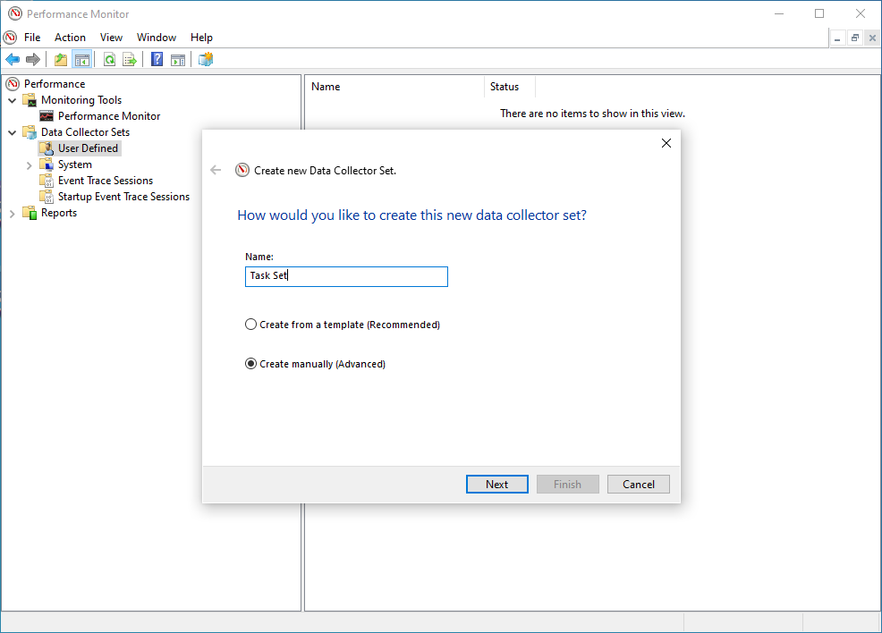
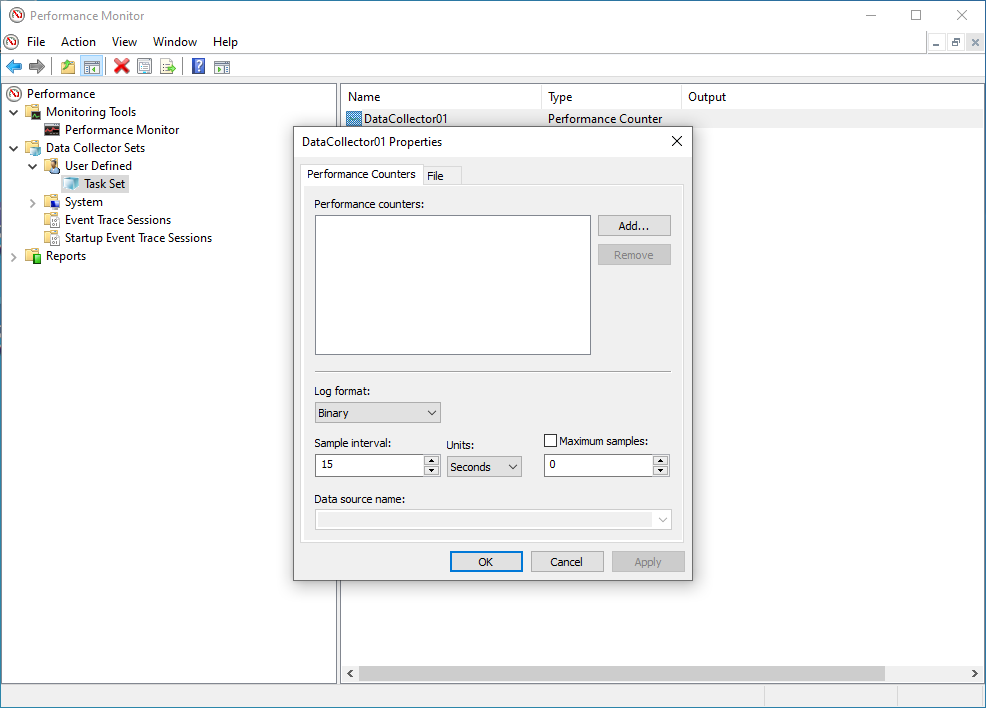
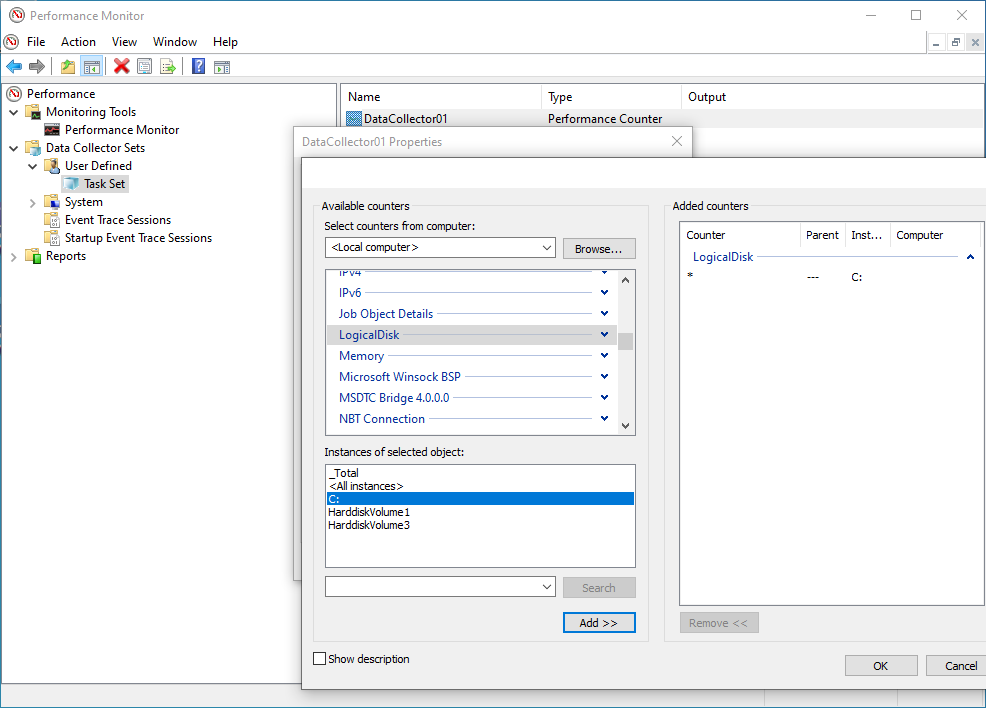
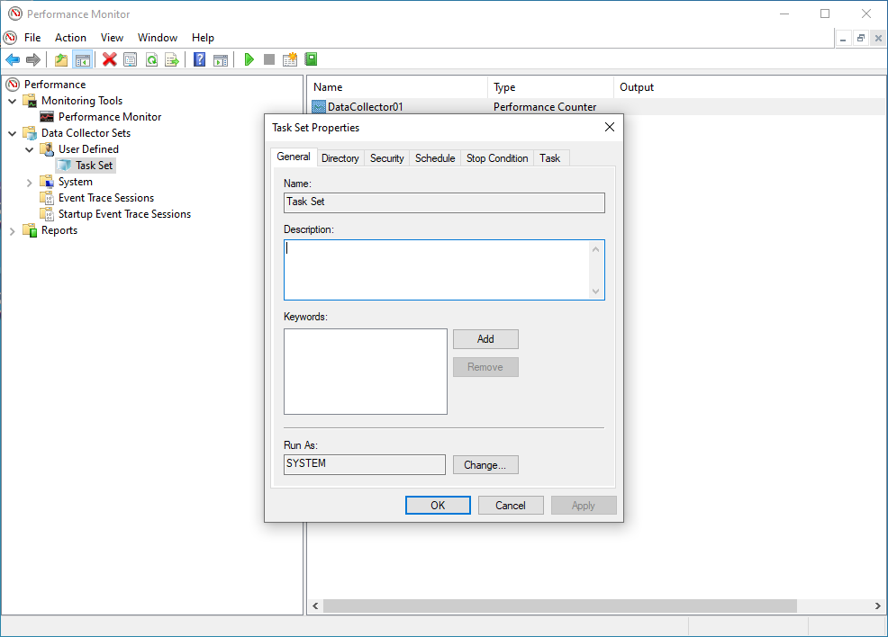
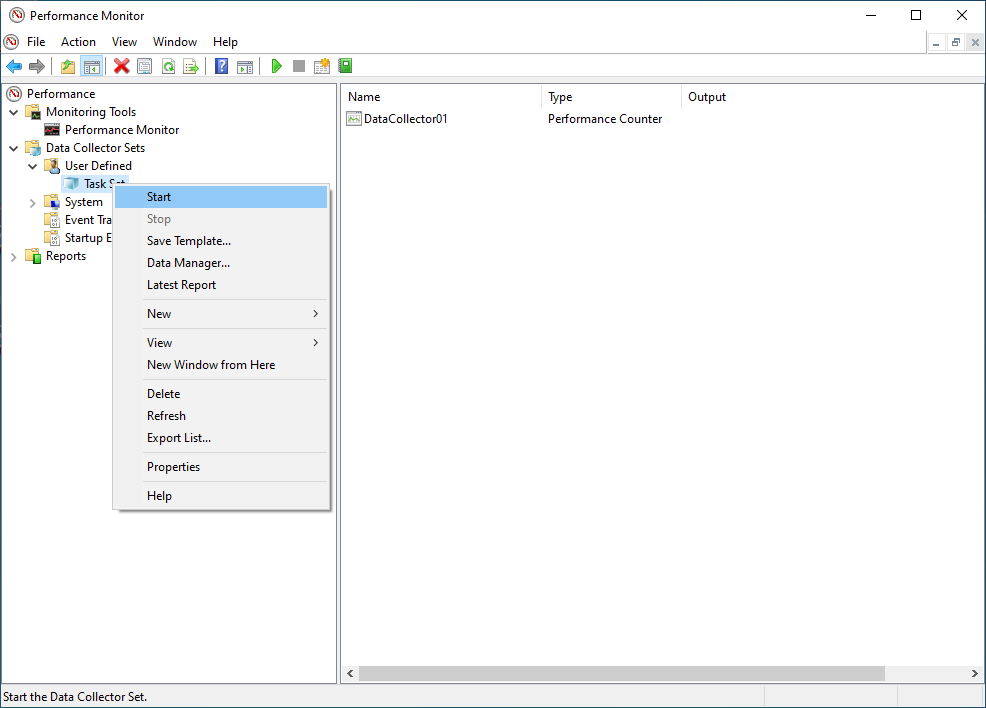
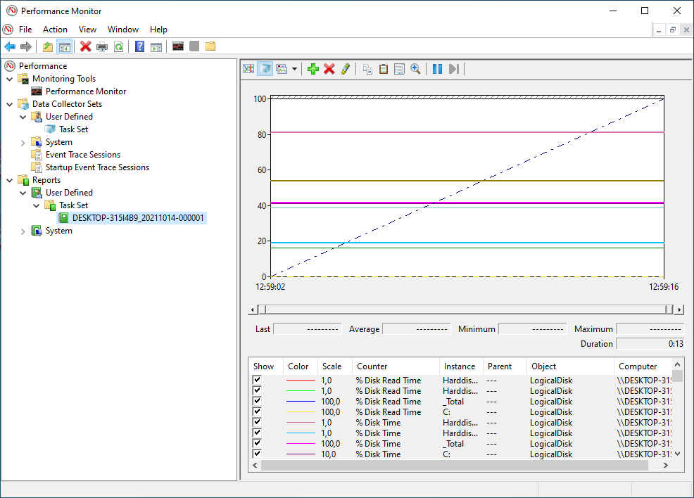

summary: BITI IPM Lab - Disk
id: biti-ipm-disk-windows-lab
categories: windows
tags: ipm, disk, BITI, introduction
status: Published
authors: Roland Pellegrini

# BITI IPM Lab - Disk

<!-- ------------------------ -->

## Before You Begin

### What You’ll Learn

In this codelab you will learn

- how to get information about the internal disk.
- how to monitor the disk with Windows Tools.
- how to perform a test run.

### What You'll need

#### Guest operation system (Guest OS)

This is the OS of the virtual machine. This will be Microsoft Windows.

<aside class="negative">
Important note: All codelabs for Microsoft Windows are tested on Windows 10 but should also work on Windows 11. 
</aside>

#### Administators privileges

By default, administrator privileges are required on the Host OS to install additional software. Make sure that you have the required permissions.

For the Guest OS, you will create and manage your own users. These users will therefore be different from the Host's user administration.

<aside class="positive">
All commands used in this codelab requires root privileges.
</aside>

## Disk Information

### What You will learn:

You can use the following command to find some information about the pyhsical or virtual disks on Windows:

- msinfo32 application

## msinfo32

The tool **msinfo32** is a built-in system profiler for Microsoft Windows which collects and displays system information about the the Operating systems, hard- and software.

To launch **msinfo32**, simple press the **Win+R** keys, type **msinfo32** and click the **OK**-button.


Details about the Disks can be found in the **Components -> Storage** Section at the **Disks** value in the right pane.

## Disk Monitoring

### What You will learn:

You can use the following application to monitor the pyhsical or virtual disks on Windows:

- Windows Performance Monitor

## Windows Performance Monitor

### Description

On Microsoft Windows, IT Administrators can use **Windows Performance Monitor** to analyze data, such as processor, hard drive, memory, and network usage.

### Sample code

To add **perfmon** counters to monitor Disk IO (Input\Output) Activity please execute the following steps.

- Run Performance Monitor (Perfmon.exe) as part of the Windows Administrative tools.
- Navigate to `Performance -> Data Collector Sets -> User Defined`.
- In the right hand pane, do a right click and Select `New - > Data Collector Set`.
- Provide a Friendly name (i.e. Task Set)
  
- Click on **Create Manually (Advanced)**.
- Click **Next**.
- Under **Create Data Logs** select `Performance Counter`.
  
- Click on **Finish**.

The data set (i.e. Task Set) should now appear in the right hand pane.

- Double click on the data set (ie Task Set)
- `DataCollector01` will appear in the right hand pane.
  
- Double click on the **DataCollector01**.
- In the `Performance Counters` tab click on **Add**.  
  
- A list of the available counters appears on the screen. Navigate to "LogicalDisk" and mark it (do NOT expand the list). Under `Instances of selected objects`, select the specific volume (drive) where the journal files are located (ie C:) and click on "Add>>".

Next, you will see something like the following in the `Added counters` window:


- Click on **OK** to return to the `DataCollector01` properties screen.
- Leave the other values at default settings - e.g. Log Format set to `Binary` and Sample Interval set to `15` seconds. Just the the right thing and click on `OK`.

You have sucessfully created the basic dataset. Congrats.

But we are not done yet, sorry. The next steps are:

- The data set (ie Task Set) should now appear in the left hand pane. Do a **right click** and select `Properties`.
- The `DataSet Properties` includes a number of tabs.  
  
  - Use the *General* tab to set user credentials with the relevant privileges to run the perfmon (By default this is set to SYSTEM).
  - Use the *Directory* tab to set the data path of where you would like to store the logs files (by default this is set to the %systemdrive% - ie C:\) we would recoomend that the log files are stored on a drive which is not being monitored as this will skew the statistics.
  - Use the *Schedule* tab to Set the days to run and the time to commence collection. This would be specific to the customers working practices, for example if the issue under investigation is seen commonly at the start of normal office hours the schedule should be set for Monday - Friday commencing at 09:00am.
  - Use the *Stop Condition* to set the parameters to stop (ie the Overall Duration of monitoring is 8 hours).
- Click on **OK** when all required parameters are configured.
- You can start data collection by selecting the DataSet (ie Task Set) with a right click to open the context menu. Click on **Start**.
  
- You can stop data collection by selecting the DataSet (ie Task Set) with a right click again. Click on **Stop** inside the context menu.
  
- Navigate to `Performance -> Reports -> User Defined --> Data set` (ie Task Set).
- Open the last recent report
  

### Metrics

All `LogicalDisk`` metrics are useful for analysis, but you should really gtake a look at the following in detail.

- **Current disk queue length**: Current Disk Queue Length is the number of requests outstanding on the disk at the time the performance data is collected. This means that the disk is not able to honor I/O requests as fast as they are being made. If the disk has a consistently high value for the Current Queue Length counter over multiple consecutive samples this suggests I/O requests latency is on the increase.
- **Disk Averages (Idle\Read\Write)**: This will give us a snapshot of the IO Trends over the period of the sample
- **Disk Read\ Write\Transfers**: This will give us the granularity of the IO activity

## Hands-on

Application performance often depends on how well and quickly storage systems can be provisioned to end users. Storage performance is usually an important factor in the deployment of an application. For this reason, the appropriate storage system must be evaluated, designed and selected in terms of IOPS as well as throughput, speed and bandwidth.

The following section describes the Microsoft tool Diskspd.exe for evaluating the performance of disk and storage systems.

### What you will learn:

In this codelab, you will learn

- how to generate workload with the diskspd.exe tool.

### What you will need:

In this codelab, you will need the following tools:

- diskspd.exe

### diskspd

### Description

The free Microsoft tool called [Diskspd.exe](https://github.com/microsoft/diskspd/releases) measures the performance of a storage system for Windows, Windows Server and Cloud Server infrastructure at Microsoft Azure and simulates various application loads. Please visit the following [page](https://github.com/Microsoft/diskspd/wiki) for updated documentation.

The program can be downloaded [here](https://github.com/microsoft/diskspd/releases)) and copied to any directory on the target server. The zipfile contains several versions, including a 64-bit variant in the amd64 folder. If you need a graphical user interface instead of the console window, you can get the Diskspd GUI from the [DiskSpeed](https://gallery.technet.microsoft.com/DiskSpeed-90d37d55) project.

To use the tool on the console, open a command prompt with **administrator rights** and then navigate to the directory where you copied and unpacked the zipfile. Finally go to the subdirectory corresponding to your target architecture (e.g. amd64).

### Scenario

In this codelab, the target is a virtual machine with 2 CPU Cores and 8 GB RAM. The operating system is based on Windows 10 Education Version 10,0,19042 Build 19042. The VM is installed and running on the Linux-based Hypervisor VirtualBox, Version 6,1.16 r140961 (QT 5.11.3). THe HostOS is based on Debian with Linux Kernel version 4.19.0-17-amd64. The Host hardware is HP Prodesk 400 G1 DN with a Intel Core i3-4160T CPU@3.10GHz, 16GB RAM, and an Intenso SATA III Top 512GB.

### Test Run

This test run is based on the Online Transaction Processing (OLTP) workload, which involves high levels of write activity.

#### SQL Server OLTP

Open a Powershell terminal as Administrator and execute diskspd.exe with the following options:

```
diskspd.exe -b8K -d180 -h -L -o32 -t3 -r -w75 -c5G sqldata.dat > result.csv
```

Where,

- **-b** - Block size of the input/output, specified as (K/M/G). For example, -b8K means a block size of 8 KB, which is relevant for SQL Server.
- **-d** - Test duration in seconds. Tests of 30-60 seconds are usually long enough to get valid results. Here, test duration is defined with 180 seconds.
- **-h** - Disables operating system-level software caching and hardware write caching. Here it is disabled becauseSQL Server works this way.
- **-L** - Captures latency information during the test
- **-o** - Pending I/Os (i.e. queue depth) per target, per worker thread.
- **-t** - worker threads per test file target. Here it is defined with 3 workers.
- **-r** - If the -r option is used, random tests are performed, otherwise sequential tests are performed. Here, SQL Server accesses data files randomly.
- **-w** - Specifies the percentage. For example, -w75 means that 75% write and 25% read operations are performed. Here, value is set to 75 because OLTP workloads involves more writung activities than reading.
- **sqldata.at** - the sample sql file name that will be used in the test.
- **-c** - Creates workload file(s) of the specified size, specified as (K/M/G).
- - **sqldata.dat** - the workload file (see option -c)
- - **result.csv** - the output file of the test results

After the execution of the test, the results are written to the file named **result.csv**. The results of the test are divided into 5 sections. The first section of the test result shows us the input parameters and all other settings.

```
Command Line: C:\Users\icinga\Downloads\DiskSpd\amd64\diskspd.exe -b8K -d180 -h -L -o32 -t3 -r -w75 -c5G sqldata.dat

Input parameters:

	timespan:   1
	-------------
	duration: 180s
	warm up time: 5s
	cool down time: 0s
	measuring latency
	random seed: 0
	path: 'sqldata.dat'
		think time: 0ms
		burst size: 0
		software cache disabled
		hardware write cache disabled, writethrough on
		performing mix test (read/write ratio: 25/75)
		block size: 8KiB
		using random I/O (alignment: 8KiB)
		number of outstanding I/O operations per thread: 32
		threads per file: 3
		using I/O Completion Ports
		IO priority: normal

System information:

	computer name: DESKTOP-12345678
	start time: 2021/10/13 17:19:51 UTC
```

In the second section we can read the details of the average CPU load.

```
Results for timespan 1:
*******************************************************************************

actual test time:	180.01s
thread count:		3
proc count:		2

CPU |  Usage |  User  |  Kernel |  Idle
-------------------------------------------
   0|   8.53%|   0.72%|    7.81%|  91.47%
   1|   8.35%|   0.68%|    7.67%|  91.65%
-------------------------------------------
avg.|   8.44%|   0.70%|    7.74%|  91.56%
```

The third section **Total IO** gives us all the performance details about the Storage performance. The total number of IOPS generated for this test is **274106**. The test duration is 180 seconds, therefore the IOPS per second is rounded up to **1523** (=result of 274106/180, note the variance to 1522.76). The AvgLat column indicates the average latency, and the result is **63.514**. The throughput per second is **11.90** MB/s.

```
Total IO
thread |       bytes     |     I/Os     |    MiB/s   |  I/O per s |  AvgLat  | LatStdDev |  file
-----------------------------------------------------------------------------------------------------
     0 |       653434880 |        79765 |       3.46 |     443.12 |   72.773 |   787.590 | sqldata.dat (5GiB)
     1 |       922140672 |       112566 |       4.89 |     625.35 |   51.558 |   658.417 | sqldata.dat (5GiB)
     2 |       669900800 |        81775 |       3.55 |     454.29 |   70.941 |   777.118 | sqldata.dat (5GiB)
-----------------------------------------------------------------------------------------------------
total:        2245476352 |       274106 |      11.90 |    1522.76 |   63.514 |   734.032
```

The fourth section is split in **Read IO** and **Write IO** operations.
The **Read IO** section contains details about the read operations.
The **Write IO** section contains details about the write operations.

```
Read IO
thread |       bytes     |     I/Os     |    MiB/s   |  I/O per s |  AvgLat  | LatStdDev |  file
-----------------------------------------------------------------------------------------------------
     0 |       163168256 |        19918 |       0.86 |     110.65 |   90.790 |   787.774 | sqldata.dat (5GiB)
     1 |       231997440 |        28320 |       1.23 |     157.33 |   65.074 |   681.015 | sqldata.dat (5GiB)
     2 |       166477824 |        20322 |       0.88 |     112.90 |   82.196 |   717.981 | sqldata.dat (5GiB)
-----------------------------------------------------------------------------------------------------
total:         561643520 |        68560 |       2.98 |     380.88 |   77.620 |   724.422

Write IO
thread |       bytes     |     I/Os     |    MiB/s   |  I/O per s |  AvgLat  | LatStdDev |  file
-----------------------------------------------------------------------------------------------------
     0 |       490266624 |        59847 |       2.60 |     332.47 |   66.776 |   787.437 | sqldata.dat (5GiB)
     1 |       690143232 |        84246 |       3.66 |     468.02 |   47.015 |   650.582 | sqldata.dat (5GiB)
     2 |       503422976 |        61453 |       2.67 |     341.39 |   67.219 |   795.673 | sqldata.dat (5GiB)
-----------------------------------------------------------------------------------------------------
total:        1683832832 |       205546 |       8.92 |    1141.88 |   58.809 |   737.150
```

The last section of the test results shows us the latency percentile analysis of the storage performance from the minimum to the maximum value. This result helps us to find out how the storage or the disks behave under different work loads.

```
total:
  %-ile |  Read (ms) | Write (ms) | Total (ms)
----------------------------------------------
    min |      0.244 |      0.149 |      0.149
   25th |      3.845 |      2.094 |      2.335
   50th |      6.232 |      3.223 |      3.896
   75th |     12.455 |      7.059 |      8.611
   90th |    145.098 |     48.302 |     63.730
   95th |    282.831 |    109.626 |    148.808
   99th |    557.531 |    451.447 |    501.254
3-nines |  13625.524 |  13619.105 |  13619.118
4-nines |  23442.732 |  23443.295 |  23443.262
5-nines |  23444.205 |  23819.563 |  23819.563
6-nines |  23444.205 |  23829.449 |  23829.449
7-nines |  23444.205 |  23829.449 |  23829.449
8-nines |  23444.205 |  23829.449 |  23829.449
9-nines |  23444.205 |  23829.449 |  23829.449
    max |  23444.205 |  23829.449 |  23829.449
```

### Clean Up

- To clean up, delete the files report.csv and the sqldata.dat.

This is the end of the hands-on.
