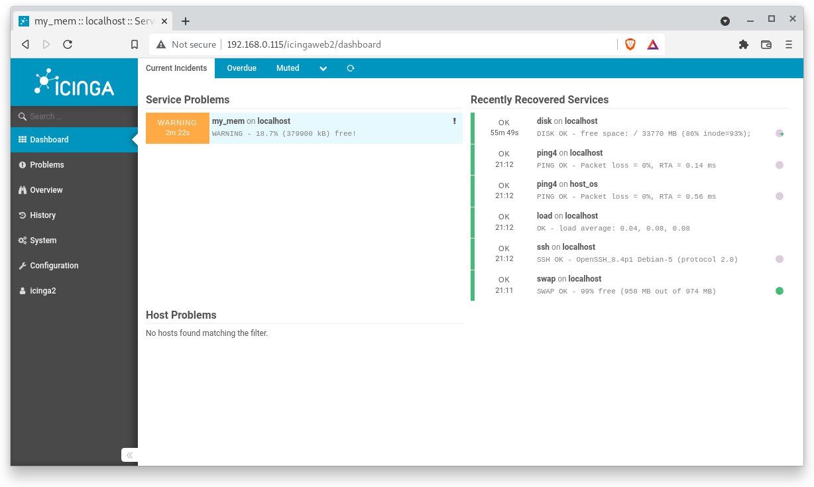
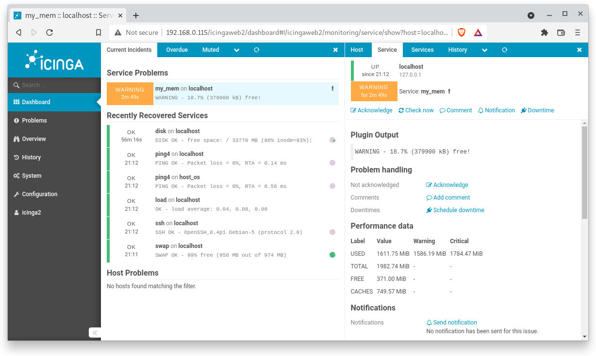

summary: BITI IPM Lab - Icinga Custom Check
id: biti-ipm-icinga-custom-check-lab
categories: icinga
tags: ipm, icinga, BITI, introduction
status: Draft
authors: Roland Pellegrini

# BITI IPM Lab - Icinga Custom Check

<!-- ------------------------ -->

## Before You Begin

### What You’ll Learn

Icinga2 comes with a bunch of pre-installed check_commands. However, there are situations where Icinga2 Administrators need to implement custom check_commands.

In this codelab you will learn

- how to create and implement a custom check_command to monitor the memory usage of the GuestOS.

### Where You Can Look Up

The best source of documentation is the homepage of Icinga2. The latest documentation can be found [here](https://icinga.com/docs/icinga-2/latest/doc/01-about/)).

### What You'll need

#### Icinga2 instance

You need a working Icinga2 instance that you can access via Icinga Web2 Frontend. If you don't have a running Icinga2 instance, please consult the Codelab **BITI IPM Lab - Icinga Installation** and **BITI IPM Lab - Icinga Agentless Monitoring** for more details.

#### Guest operation system (Guest OS)

This is the OS of the virtual machine. This will be Debian.

#### Administators privileges

By default, administrator privileges are required on the Host OS to install additional software. Make sure that you have the required permissions.

For the Guest OS, you will create and manage your own users. These users will therefore be different from the Host's user administration.

### Root privileges via sudo

In this codelab you have to work with root privileges. Therefore, a few words of caution: double check whatever you type and make backups whenever necessary.

Working with root privileges is quite easy. Open a terminal (a shell) and enter the following commmand:

```
sudo -s
```

Enter the password of the icinga user and voila:

```
root@server:/home/icinga#
```

Once you are root via sudo, it is no longer necessary to prepend the sudo command. Instead of `sudo ls -lisa /root/` you can also type `ls -lisa /root/` because you have root privileges already. However, all commands in this codelab will always start with `sudo` to remind you that you are working with root privileges.

## Get the plugin

In fact, there are many different check_mem plugins for Icinga2. However, we want to install and use a revised version of check_mem.pl that splits memory detection into cache memory and application memory.

First, change the working directory in which the plugins are located. Run the following command:

```
sudo cd /usr/lib/nagios/plugins
```

In this directory you will find a number of check plug-ins, simply execute the command `sudo ls -al`. Unfortunately, you will not find a `check_mem` plugin here. Fortunately, we can download a revised version from the internet by running the following command:

```
sudo wget https://raw.githubusercontent.com/justintime/nagios-plugins/master/check_mem/check_mem.pl
```

The command `wget` is a small command-line utility from the GNU project for downloading files from the Internet. 

Sample output:

```
--2021-12-03 22:45:11--  https://raw.githubusercontent.com/justintime/nagios-plugins/master/check_mem/check_mem.pl
Resolving raw.githubusercontent.com (raw.githubusercontent.com)... 185.199.110.133, 185.199.108.133, 185.199.111.133, ...
Connecting to raw.githubusercontent.com (raw.githubusercontent.com)|185.199.110.133|:443... connected.
HTTP request sent, awaiting response... 200 OK
Length: 15019 (15K) [text/plain]
Saving to: ‘check_mem.pl’

check_mem.pl                        100%[======================================================================>]  14.67K  --.-KB/s    in 0s

2021-12-03 22:45:12 (85.4 MB/s) - ‘check_mem.pl’ saved [15019/15019]
```

Next, make sure that the plugins is executable:

```
sudo chmod +x /usr/lib/nagios/plugins/check_mem.pl
```

Next, run the script with the following parameters:

```
sudo /usr/lib/nagios/plugins/check_mem.pl -f -w 20 -c 10
```

Where,

- `-f` - tell the plugin to check for free memory
- `-w` - specify the warning threshold as number interpreted as percent
- `-c` - specify the critical threshold as number interpreted as percent

Sample output:

```
WARNING - 14.1% (286656 kB) free!|TOTAL=2030328KB;;;; USED=1743672KB;1624262;1827295;; FREE=286656KB;;;; CACHES=817248KB;;;;
```


<aside class="positive">
The standard nagios-plugins package doesn’t include the check_mem.pl, it has to be loaded seperately. The reason is that the original script returns wrong values on special operating systems (like Windows). 
</aside>

## Create the check
Now we need to make this new plugin generally available. To do this, we need to add a new command definition in the configuration file. Follwo me.

First, change the working directory and open the file `comand.conf` with an editor of your choice (here: nano).
```
sudo cd /etc/icinga2/conf.d/
sudo nano /etc/icinga2/conf.d/commands.conf
```

Next, go to the bottom of this file and add the command definition:

```
object CheckCommand "my_mem" {
  import "plugin-check-command"

  command = [ PluginDir + "/check_mem.pl" ]

  arguments = {
    "-f" = {
      description               = "Check FREE memory"
      required                  = false
      set_if                    = "$mem_free$"
    }
    "-u" = {
      description               = "Check USED memory"
      required                  = false
      set_if                    = "$mem_used$"
    }
    "-C" = {
      description               = "Count OS caches as FREE memory"
      required                  = false
      set_if                    = "$mem_cache$"
    }
    "-w" = {
      value                     = "$mem_warning$"
      description               = "Percent free/used when to warn"
      required                  = true
    }
    "-c" = {
      value                     = "$mem_critical$"
      description               = "Percent free/used when critical"
      required                  = true
    }
  }
  vars.mem_warning           = "30"
  vars.mem_critical          = "15"
}
```

This CheckCommand is pretty well self-explanatory.

- Each CheckCommand needs a name. We will simply call it `my_mem`.
- The CheckCommand imports the `plugin-check-command` which tells Icinga2 how to execute commands.
- The `command` variable refers to the `check_mem.pl` plugin (the PluginDir points to the **/usr/lib/nagios/plugins** directory).
- The `argument` section describes all parameters that are accepted by the plugin.
- The default settings for `mem_warning` and `mem_critical` are set and defined here.

Do not forget to quit the editor with `CTRL-X`. Confirm with `y` to save all changes.

<aside class="positive">
Hint: Check on open brackets.
</aside>

## Implement the check

To use our new CheckCommand, we need to implement it on GuestOS. Follow me.
First, open the file `localhost.conf` with an editor of your choice (here: nano):
```
sudo nano /etc/icinga2/conf.d/hosts/localhost.conf
```

Next, go to the bottom of this file and add the service definition:

```
object Service "my_mem" {
    host_name = "localhost"
    check_command = "my_mem"
    vars.mem_warning = "20"
    vars.mem_critical = "10"
    vars.mem_used = "false"
    vars.mem_free = "true"
}
```

<aside class="positive">
Note: we overwrite the thresholds for both, warning and critical.
</aside>

Finally, don't forget to quit the editor with `CTRL-X`. Confirm with `y` to save all changes.

## Test and restart

Okay, time to test the configuration. Run the command:

```
sudo icinga2 daemon -C
```

Do you see errors? If yes, try to fix them. Otherwise, if not errors occur, restart and check the status of the Icinga2 service:

```
sudo systemctl restart icinga2
sudo systemctl status icinga2
```

Any errors occur? Try to fix them. Otherwise, continue.

## In action

After restarting Icinga2, we want to see our new CheckCommand `my_mem` in action. Depending on the setup of your GuestOS, you may see different status messages. For example, the next screenshot shows a warning message:



Click on the warning box to get more details.



Great, everything works fine.

## Cleanup

Congratulations !

You have successfully set up your first custom CheckCommand.
