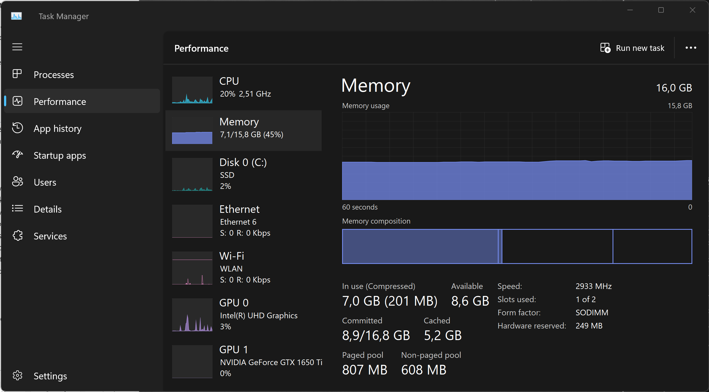
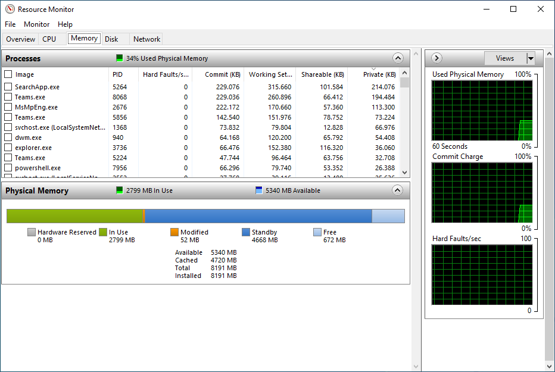
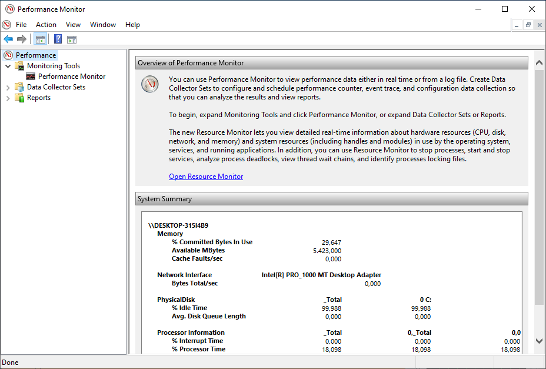
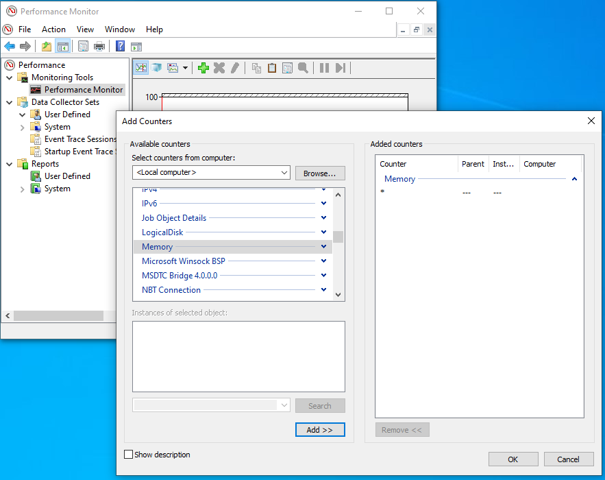
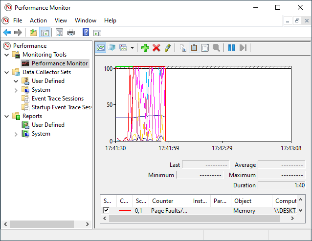
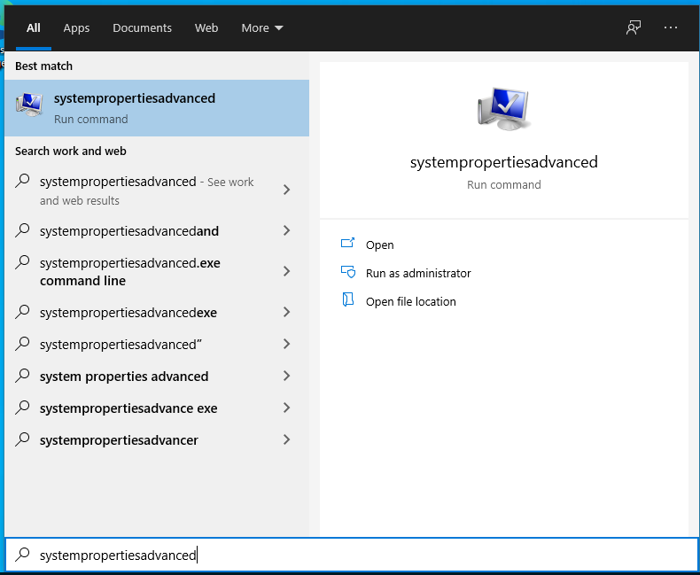
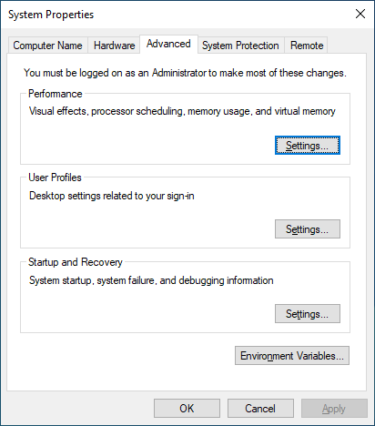
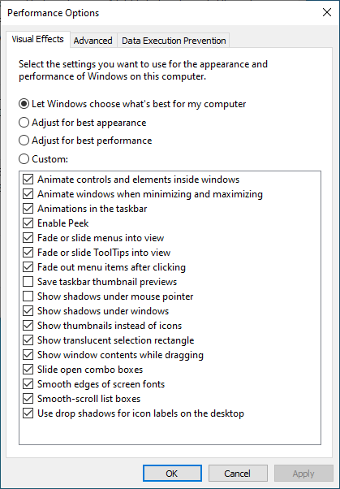
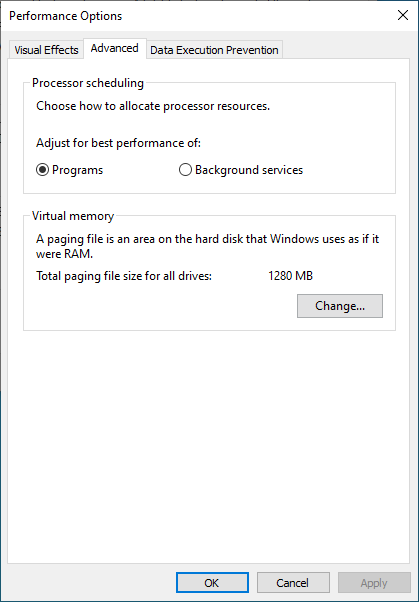
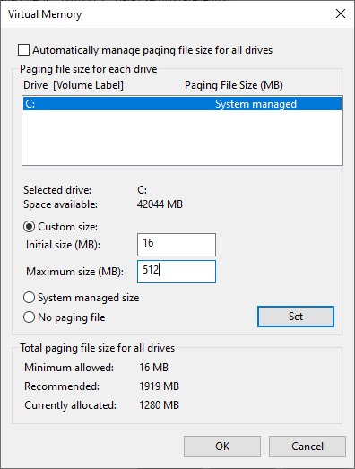

summary: BITI IPM Lab - Memory
id: biti-ipm-memory-windows-lab
categories: windows
tags: ipm, memory, ram, BITI, introduction
status: Published
authors: Roland Pellegrini

# BITI IPM Lab - Memory
<!-- ------------------------ -->
## Before You Begin 

### What You’ll Learn
In this codelab you will learn

* how to get information about the Memory.
* how to monitor Memory with Windows Tools.

### What You'll need

#### Guest operation system (Guest OS)

This is the OS of the virtual machine. This will be Microsoft Windows.

<aside class="negative">
Important note: All codelabs for Microsoft Windows are tested on Windows 10 but should also work on Windows 11. 
</aside>

#### Administators privileges

By default, administrator privileges are required on the Host OS to install additional software. Make sure that you have the required permissions.

For the Guest OS, you will create and manage your own users. These users will therefore be different from the Host's user administration. 

## Memory information

### What You will learn:

You can use one of the following commands to find detailed information about the physical CPUs (pCPU) including all cores on Linux:

* meminfo32  
* systeminfo
* pagefile

## msinfo32

### Description

The tool **msinfo32** is a built-in system profiler for Microsoft Windows which collects and displays system information about the the Operating systems, hard- and software.

### Sample code

To launch **msinfo32**, simple press the **Win+R** keys, type **msinfo32** and click the **OK**-button.


Details about the CPU can be found in the System Summary section at the Processor value in the right pane.

## Systeminfo

### Description

The command-line tools **systeminfo** displays detailed configuration information about a computer and its operating system, including system configuration, security information, product details, and hardware properties.

### Sample code

Launch Windows PowerShell as an administrator, enter the command:

```
systeminfo
```

### Sample output

The Windows PowerShell window displays some information about the memory on this computer.

```
--More--
Total Physical Memory:     8.192 MB
Available Physical Memory: 4.974 MB
Virtual Memory: Max Size:  9.472 MB
Virtual Memory: Available: 6.322 MB
Virtual Memory: In Use:    3.150 MB
Page File Location(s):     C:\pagefile.sys
--More--
```

## Memory Monitoring

### What You will learn:
You can use one of the following application to monitor the CPU on your Windows Host.

* Windows Task Manager (TaskMan)
* Windors Resource Monitor (ResMon)
* Windows Performance Monitor (PerfMon)

## Windows Task Manager

### Description

The **Windows Task Manager** is a utility program that reports the status of running programs. IT Administrators can use the Task Manager to monitor the performance of the computer, and to close a program that is not responding. Additionally,  Administrators can view network status, and see which users are connected to the computer.

### Sample code

The **Windows Task Manager (Taskmon)** is a system tool found in all versions of Microsoft Windows platform's. It provides information about running applications, processes, and services, as well as computer performance, network activity, and memory information. There are two views for the Task Manager: Simplified and Advanced.

To use Taskmon, open Start, do a search for **taskman**, and confirm the result.


To see application memory used by applications, go to tab Processes and click on column Memory.


Microsoft improves the Task Manager between each version of Windows. Currently, Taskmon under Windows 11 has a redesigned look and some new features. Here is a list of running processes.


And here is a smart overview of the current performance.



Learn more about the Task Manager from [Microsoft Learn](https://learn.microsoft.com/en-us/shows/inside/task-manager) or from [LifeWire](https://www.lifewire.com/task-manager-2626025#toc-task-manager-walkthrough).


## Windows Resource Monitor

### Description

The **Windows Resource Monitor (Resmon)** is a system application included in Windows Vista and later versions of Windows that allows users to look at the presence and allocation of resources on a computer.

The Windows Task Manager can best be described as a tool that runs **on** the surface. It lists processes and services, and general resource usage. In contrast, the Resource Monitor gives you the option to look **under** the surface to get more information that the Task Manager does not provide.

The Windows Resource Monitor can be used to determine extensive and detailed information about the current performance and resource consumption in real time. The program is therefore also suitable for error analysis. The view is divided into the following sections:

- Overview (CPU, disk, network, memory)
- CPU 
- Memory 
- Disk 
- Network 

### Sample code

To use Resmon, open Start, do a search for **resmon**, and confirm the result. Click on the Tab "Memory".




## Windows Performance Monitor

### Description

On Microsoft Windows, IT Administrators can use **Windows Performance Monitor** to analyze data, such as processor, hard drive, memory, and network usage.

### Sample code

To use Perfmon, open Start, do a search for **perfmon**, and confirm the result.



When you open the tool, the main page will show up with a brief overview, a system summary with real-time data about Memory, Network Interface, Physical Disk, and Processor Information. On the keft side, you will find the navigation pane with access to Monitoring Tools, Data Collector Sets, and Reports.<br>
<br>
When you switch to the Performance Monitor, you will see a screen with a single counter. This is typically the **Processor Time** counter, which displays the processor load.
<br>


However, you can add a lot of other counters to monitor virtually anything on your computer. To add new counters to monitor applications and hardware performance on your computer, do the following steps:

* Click on the green **Plus** button above the Performance Monitor graph.

* Select Local computer (or the name of your computer) from the drop-down menu.

* Select and expand the category of the item you want to monitor. 

* If applicable, select the instances you want to monitor. Click the **Add** button to add the new counters.



* Finally, click on the **OK** button to confirm. Here you are !




## Pagefile Configuration

### Description

A page file (also known as a "paging file") is an optional, hidden system file on a hard disk. Page files enable the system to remove infrequently accessed modified pages from physical memory to let the system use physical memory more efficiently for more frequently accessed pages.

Page file sizing depends on the system crash dump setting requirements and the peak usage or expected peak usage of the system commit charge. Both considerations are unique to each system, even for systems that are identical. This means that page file sizing is also unique to each system and cannot be generalized.

### Pagefile size

If you want to change the the size of the pagefile, then follow me:

* Press the Windows key.

* Type `SystemPropertiesAdvanced`. You’ll see this:


* Click on **Run as administrator**. You’ll see the advanced properties page:



* Click on **Settings...** You’ll see the performance options tab.



* Select the **Advanced** tab. You’ll see the following panel.



* Select **Change…**. You’ll see the following panel.


* Make sure the checkbox `Automatically managing paging file size for all drives` is not checked, as shown above. Then select `Custom size:` and fill in an appropriate size (here: 16MB, 512MB)



* Click on **Set**, then click on **Ok**. Finally, exit from the Virtual Memory, Performance Options, and Systems Properties Dialog.

* Reboot your system. Yes!

### Committed  Memory
 
Page files extend how much "committed memory" (also known as "virtual memory") is used to store modified data. The system commit memory limit is the sum of physical memory and all page files combined. It represents the maximum system-committed memory (also known as the "system commit charge") that the system can support. In our case, the committed memory is 2,8 / 9,2 GB.


The system commit charge is the total committed or "promised" memory of all committed virtual memory in the system. If the system commit charge reaches the system commit limit, the system and processes might not get committed memory. This condition can cause freezing, crashing, and other malfunctions. Therefore, make sure that you set the system commit limit high enough to support the system commit charge during peak usage.