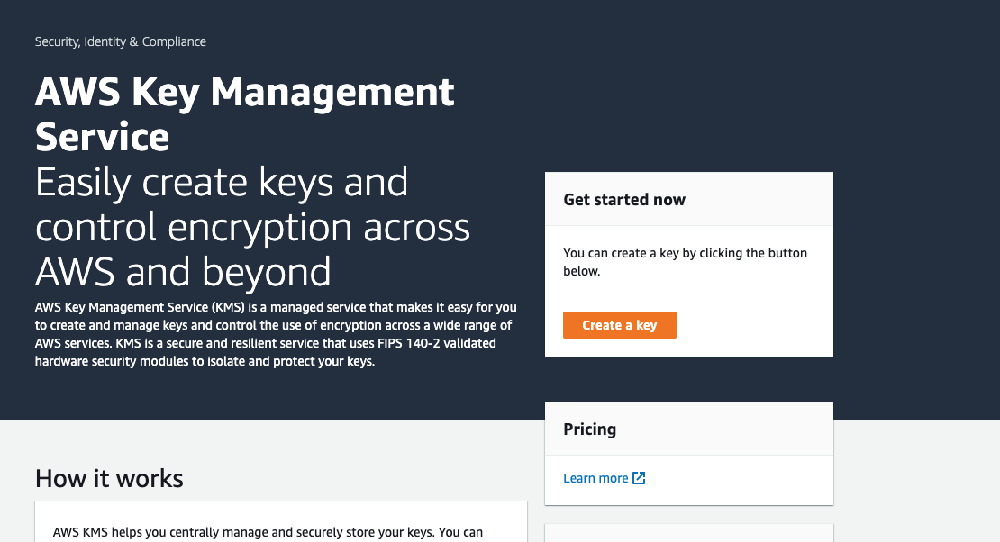
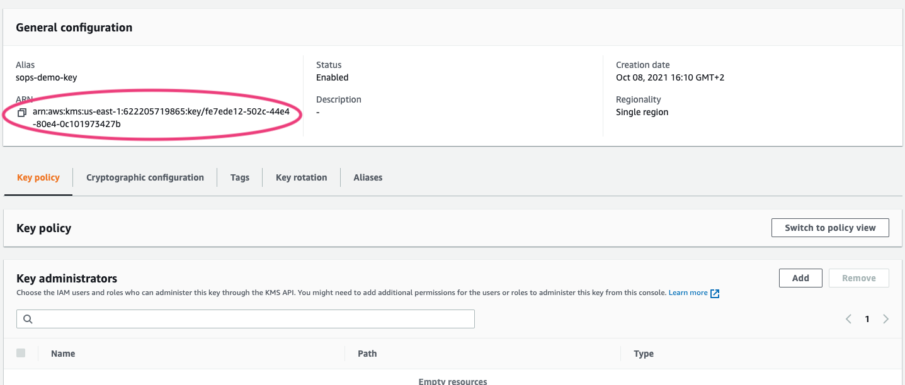

summary: SSOA Extra Lab - Mozilla SOPS and Amazon KMS
id: ssoa-pt-sops-kms
categories: aws
tags: secrets, aws, MCCE, ssoa-pt, advanced
status: Published
authors: Thomas Schuetz

# SSOA Extra Lab - Encrypting Secrets with SOPS and KMS
<!-- ------------------------ -->


## Overview

### Use Case
An application which needs secrets to be operated is installed on an EC2 Instance. Secrets stored in a configuration file should be handled in a way, that they could be checked in in a git repository and decrypted on the target machine. There they will be stored in the environment and used by the application.

In this lab, Mozilla SOPS is used to encrypt the secrets in a file. SOPS itself acts as an editor for such encrypted files and is able to deal with YAML, JSON, ENV, INI and BINARY (in this example .env) file formats. Furthermore, SOPS is able to deal with various Keys (AWS KMS, GCP KMS, Azure Key Vault, age, and PGP), in this case we'll use AWS KMS.

### Strengths
There is no sophisticated handling of keys (e.g. GPG Keys) needed to deal with the secrets, the whole key handling happens in AWS. If users have the permission to access the KMS Key, they are able to read and write the secrets. We don't have to ship the secret to the EC2 Instance, as an assigned IAM Role allows the Instance to use the secret. As we'll see later, the usage of SOPS is pretty straightforward on the server-side. As SOPS supports lots of cloud providers and also GPG, it can be considered as cloud-agnostic (surely, the mechanisms to create keys and roles change).

### Weakness
Nevertheless, the secret exist in clear-text on the server (as environment variables or files).

### What we'll do in this lab


* This lesson will start with the creation of an AWS instance which will be used as a server
* Next, we will create an AWS KMS Key to be used with SOPS
* Afterward, we will install SOPS on our developer machine and the server
* Then, the created KMS Key will be used to encrypt variables in an env file with SOPS
* After that, the env file will be copied to the server and used as environment variables
* Finally, we will use the defined secrets in a web application

References:
* https://github.com/mozilla/sops
* https://aws.amazon.com/kms/
* https://medium.com/mercos-engineering/secrets-as-a-code-with-mozilla-sops-and-aws-kms-d069c45ae1b9
* https://daveops.xyz/en/2020/10/17/encrypting-helm-secrets-with-mozilla-sops-and-aws-ksm
* https://poweruser.blog/how-to-encrypt-secrets-in-config-files-1dbb794f7352

## (Creating an IAM Role)
<aside class="negative">
This will not work on the AWS Academy Labs, but is needed in the "Real World". In the AWS Academy proceed with the pre-created Role "LabRole" 
</aside>

* Open the AWS Console
* Type Roles in the Search Bar and select "Roles (IAM Feature)"
* Click on "Create Role"
  * AWS Service
  * EC2
  * Next: Permissions
  * Next: Tags
  * Next: Review
  * Role Name: "LabRole" (if it doesn't exist)
  * Create Role

## Install AWS CLI (on your machine)
As it will be easier to deal with SOPS from your machine, please install the AWS CLI on your machine. The Installation Instructions can be found [here](https://docs.aws.amazon.com/cli/latest/userguide/install-cliv2.html).

## Get your AWS Configuration
* In the AWS Academy
  * Click on AWS Details
  * Show AWS CLI Credentials and copy them

* Copy them to your machine ~/.aws/credentials

* After that, you should be able to communicate with your AWS environment, so try a simple command e.g. 
```aws ec2 describe-instances```

<aside class="positive">
If you see no errors, you are able to access AWS with your CLI now
</aside>

## Start a VM in AWS

### Create a security group for SSH
```
aws ec2 create-security-group --group-name sops-lab-ssh-in --description "SSH Traffic for SOPS Lab Instances"
aws ec2 authorize-security-group-ingress \
    --group-name sops-lab-ssh-in \
    --protocol tcp \
    --cidr 0.0.0.0/0 \
    --port 22
```

### Create an Instance
```
aws ec2 run-instances --image-id ami-087c17d1fe0178315 --instance-type t2.micro --tag-specifications "ResourceType=instance,Tags=[{Key=Name,Value=sops-instance}]" --key-name vockey --security-groups "sops-lab-ssh-in" --iam-instance-profile Name=LabInstanceProfile --output table
```

<aside class="negative">
Note that we specified an InstanceProfile here ("--iam-instance-profile Name=LabInstanceProfile"). This has been pre-created in the AWS Academy. For further information about instance profiles, see https://docs.aws.amazon.com/IAM/latest/UserGuide/id_roles_use_switch-role-ec2_instance-profiles.html.
</aside>

## Get the SSH Keys for your Instances
The EC2 instance has been created with an SSH Key which is available in the AWS Academy environment. You can fetch the keys the same way you got your AWS CLI Configuration (AWS Academy -> AWS Details -> SSH Key).

For the further progress of this lab, it's the easiest way to store the PEM Key in ~/.ssh/labsuser.pem

### Get the Name of this Instance / Connect to the Instance
* Get the name of the Instance and write it to an environment variable
```
INSTANCE_HOSTNAME=$(aws ec2 describe-instances --filters "Name=tag:Name,Values=sops-instance" --query "Reservations[].Instances[].PublicDnsName" --out text | xargs)
```
* Print the hostname
```
echo "ssh -i ~/.ssh/labsuser.pem ec2-user@${INSTANCE_HOSTNAME}"
```

* SSH to the Instance
```
ssh -i ~/.ssh/labsuser.pem ec2-user@${INSTANCE_HOSTNAME}
```

<aside class="negative">
Ensure that your SSH Key has the correct permissions eg. `chmod 400 ~/.ssh/labsuser.pem`
</aside>

## Install SOPS on the machines
You will need Mozilla SOPS on both (the developer machine and the application server).

Therefore, download the application from [Releases](https://github.com/mozilla/sops/releases).

### On Mac (Homebrew)
Install SOPS using `brew install sops`

### On Linux
* Download SOPS and copy it to /usr/local/bin 
```
curl -sfL https://github.com/mozilla/sops/releases/download/v3.7.1/sops-v3.7.1.linux -o /tmp/sops
chmod a+x /tmp/sops
sudo cp /tmp/sops /usr/local/bin/ 
```

## Create a Key in the Key Management Service
* Open the AWS Console
* Type "KMS" in the Search Field and select "Key Management Service"



* Click on "Create a Key"
  * Symmetric Key
  * Key material origin: KMS
  * Regionality: Single-region key
  * Next

* Alias description
  * Name: sops-demo-key
  * Next

* Key Administrators
  * None
  * Next

* Key Users
  * LabRole
  * Next

* Finish

### Get the ARN of your Key from the Console
* Click on your newly created Key
* You should see something like this:

* Copy this somewhere you can easily access it, you'll need it in the next step

## Create your secret

* If not already done, install SOPS
* Create your config file as follows
  * execute following steps
```
  ARN="The ARN you noted down"
  sops --kms $ARN secret.env
```

* An editor will open, remove everything and add the following:
```
APP_SECRET="my-super-secret-string"
```

* Close the editor (:x in vi)
* Simply try to open up the file secret.env with a text editor
  * You should see that the variable itself is shown in clear-text, but the secret is encrypted
  * Furthermore, you should see that the arn of the AWS Key is stated in this file now, this makes it possible for you to open the file using `sops secret.env` now
  * Close the file again
* You can change the file at any time using `sops secret.env` now

## Use your secret
* Now, copy the secret to your server
```bash
scp -i ~/.ssh/labsuser.pem secret.env ec2-user@${INSTANCE_HOSTNAME}:/tmp/secret.env
```

* SSH to the Instance
```
ssh -i ~/.ssh/labsuser.pem ec2-user@${INSTANCE_HOSTNAME}
```

### Install the sample application
* Download the sample application
```bash
curl -sfL https://github.com/fhb-codelabs/secret-demo-app/releases/download/0.0.1/secret-demo-app-linux-amd64 -o /tmp/secret-demo-app
chmod a+x /tmp/secret-demo-app
```

* Create the directory /opt/demo-app if it doesn't exist
```bash
if [[ ! -d /opt/demo-app ]]; then 
  sudo mkdir /opt/demo-app
fi
```

* Move the Binary 
```bash
sudo mv /tmp/secret-demo-app /opt/demo-app
```

### Set the environment and start the application
* Run the application
```
/opt/demo-app/secret-demo-app
```

* You should see the following output now
```
2021/10/08 16:56:49 No port is set, defaulting to 8080
2021/10/08 16:56:49 Secret to start this up is missing, the APP_SECRET environment variable might be unset
```

<aside class="negative">
If the environment variable APP_PORT is not set, it will default to Port 8080 (therefore, the port is configurable). If it doesn't find a secret in the APP_SECRET environment variable, it will fail as now
</aside>

* Set the environment variables from our secret file using sops
```
export $(sops --decrypt /tmp/secret.env | xargs)
```

* Run the application again
```
/opt/demo-app/secret-demo-app
```

* The application should start now

### Verify
* Open a new ssh session to the server
* Verify the output of the application (you should see your secret)
```
curl http://localhost:8080
```

* This should result in the following output:
```
> curl localhost:8080
Hi there, your secret is my-super-secret-string
```

<aside class="positive">
Congratulations, you have successfully created your SOPS secret and used KMS to encrypt and decrypt it!
</aside>

## Counter-Check
If we create a virtual machine without the instance profile, we shouldn't be able to decrypt the secret.

* Therefore, we create a new machine:
```
aws ec2 run-instances --image-id ami-087c17d1fe0178315 --instance-type t2.micro --tag-specifications "ResourceType=instance,Tags=[{Key=Name,Value=sops-instance-2}]" --key-name vockey --security-groups "sops-lab-ssh-in" --output table
```

* Get the name of the Instance and write it to an environment variable
```
INSTANCE_HOSTNAME_2=$(aws ec2 describe-instances --filters "Name=tag:Name,Values=sops-instance-2" --query "Reservations[].Instances[].PublicDnsName" --out text | xargs)
```
* Print the hostname
```
echo "ssh -i ~/.ssh/labsuser.pem ec2-user@${INSTANCE_HOSTNAME_2}"
```

* SSH to the Instance
```
ssh -i ~/.ssh/labsuser.pem ec2-user@${INSTANCE_HOSTNAME_2}
```

* Install SOPS
```
curl -sfL https://github.com/mozilla/sops/releases/download/v3.7.1/sops-v3.7.1.linux -o /tmp/sops
chmod a+x /tmp/sops
sudo cp /tmp/sops /usr/local/bin/ 
```

* Copy the encrypted secret from the Developer Machine
```bash
scp -i ~/.ssh/labsuser.pem secret.env ec2-user@${INSTANCE_HOSTNAME_2}:/tmp/secret.env
```

* Try to open the secret (on the server)
```
sops --decrypt /tmp/secret.env
```

* You should see the following error message:
```
Failed to get the data key required to decrypt the SOPS file.

Group 0: FAILED
  arn:aws:kms:us-east-1:<REDACTED>: FAILED
    - | Error decrypting key: NoCredentialProviders: no valid
      | providers in chain. Deprecated.
      | 	For verbose messaging see
      | aws.Config.CredentialsChainVerboseErrors

Recovery failed because no master key was able to decrypt the file. In
order for SOPS to recover the file, at least one key has to be successful,
but none were.
```
<aside class="positive">
The secret can only be decrypted, when the InstanceProfile is assigned
</aside>
