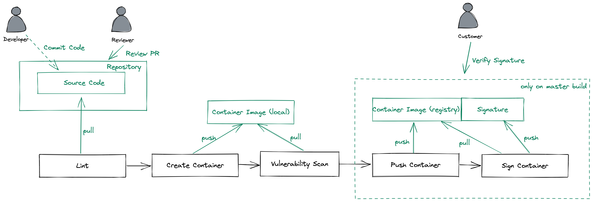
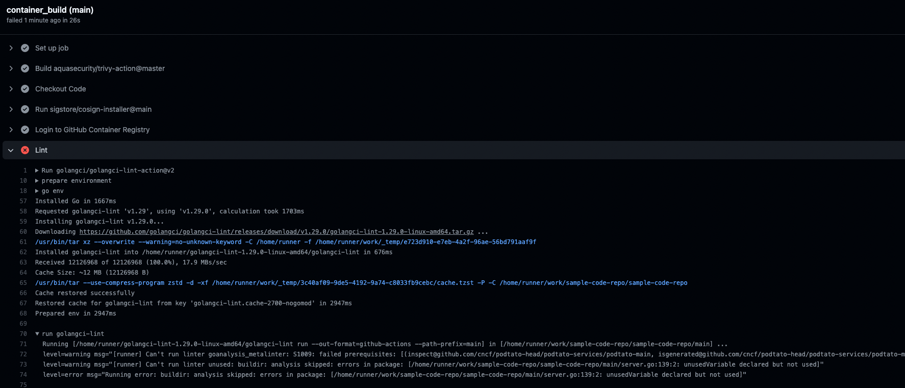
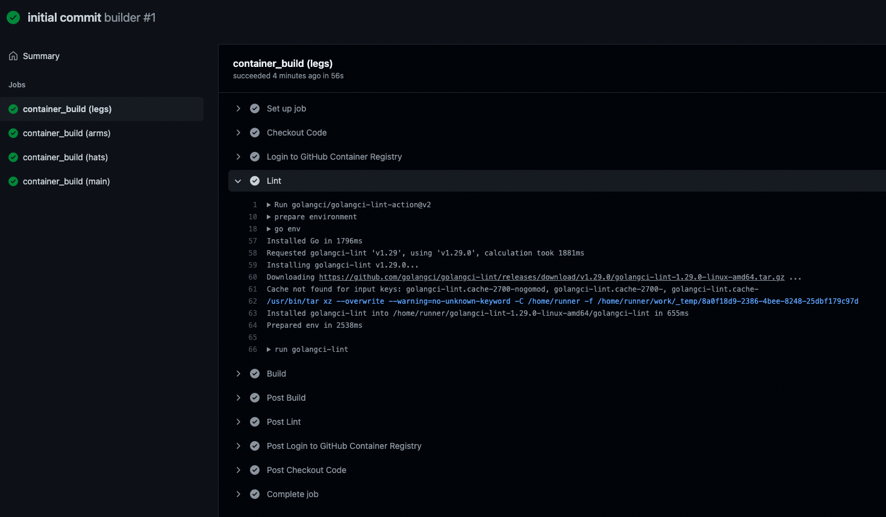
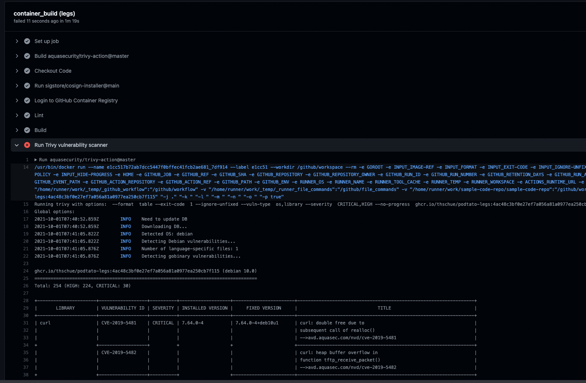
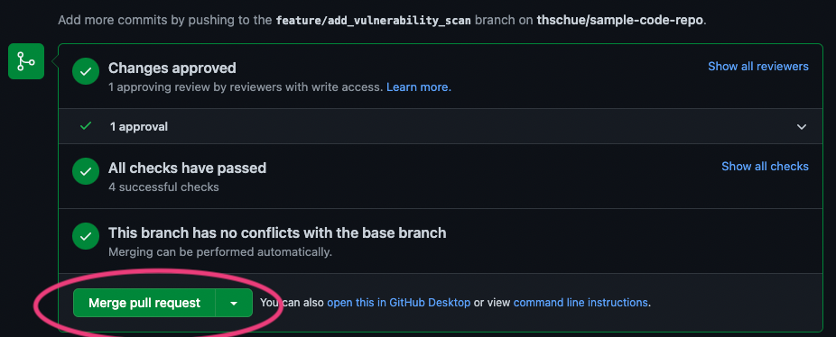

summary: Lab 2 - Supply Chain
id: ssoa-pt-supply-chain-lab
categories: MCCE-SSOA-PT
tags: supply-chain, aws, MCCE, ssoa-pt
status: Published
authors: Thomas Schuetz

# SSOA Lab 2 - Supply Chain
<!-- ------------------------ -->


## Overview

### What You’ll Learn



* Set up an CI Pipeline using GitHub Actions
* Going through an PR workflow
* Doing some static code analysis
* Build a container
* Do vulnerability scans on your containers
* Sign the containers and verify the signature

## Prepare your git environment

### Create a fork of this repository

* Navigate to https://github.com/fhb-codelabs/sample-code-repo and click "Fork"
* Select the Account or Organization in which the fork should be created
* Afterwards you should have got a fork of this repository in your account

### (Optional) Check out your Fork
* Open a shell
* Change to the directory, in which the repository should be cloned
* Clone the repository (replace fhb-codelabs against your username/org).
```
git clone https://github.com/fhb-codelabs/fhb-codelabs.github.io.git
```

## Do some initial hygiene on your git repository
* Click on Settings -> Branches
* Use "Branch Protection Rules" -> Add Rule 
  * Branch Name Pattern: `master`
  * Check "Require a pull request before merging"
    * Require approvals 
  * Check "Require status checks to pass before merging"

## Invite your peer to get contributor of your repository
* Settings -> Manage Access
  * Add People
  * Add the Name of your Peer
  * Add to the Repository
  * Afterwards your colleague should get an invitation, please accept
  * Now your colleague should have some more permissions on your repository

## Create a PAT and add it to your Repository
* Settings -> Developer Settings
  * Personal Access Token
  * Add some Name: `podtatohead-ghcr-token`
  * Choose Permissions:
    * `write:packages`
  * Generate Token
   * Copy your Token

* Go Back to your Repository
* Settings -> Secrets -> Actions
  * New Repository Secret
    * Name: CR_PAT
    * Value: `"insert token here"`
  
## Our First Pipeline Steps
* Code -> Add File -> Create File
  * Name: .github/workflows/build.yaml
  * Add following content
  
```yaml
name: builder

on:
  push:
    branches:
      - 'master'

  pull_request:
    branches:
      - 'master'

jobs: 
##################################
#         Build Artefacts        #
##################################
  container_build:
    runs-on: ubuntu-20.04
    strategy:
      matrix:
        component: [ "legs", "arms", "hats", "main" ]
    steps:
    - name: Checkout Code
      uses: actions/checkout@v2
 
    - name: Login to GitHub Container Registry
      if: ${{ github.ref == 'refs/heads/master' || github.ref == 'refs/heads/release-*' }}
      uses: docker/login-action@v1
      with:
        registry: ghcr.io
        username: ${{ github.repository_owner }}
        password: ${{ secrets.CR_PAT }}
          
    - name: Lint
      uses: golangci/golangci-lint-action@v2
      with:
        version: v1.29
        working-directory: ${{ matrix.component }}
      
    - name: Build
      id: docker_build
      uses: docker/build-push-action@v2
      with:
        build-args: |
        context: ${{ matrix.component }}/.
        push: false
        file: ${{ matrix.component }}/docker/Dockerfile
        platforms: linux/amd64
        tags: |
           ghcr.io/${{ github.repository_owner }}/podtato-${{ matrix.component }}:${{ github.sha }}
```
* Push directly to master, create a useful commit message
* This lints some code and creates container images. If everything is ok, we can build and push our containers

## Find out what's happening
* Our github actions should run now
* Click on "Actions" in the Code Repository
* You should see a workflow using the name of your commit message

### There's an issue

* Let's fix this issue in the code
* After the issue is fixed, commit the fix and the pipeline will re-run 

### First success
* When clicking on the workflow -> show all -> container_build (main) you should see a similar output (Lint step):


<aside class="positive">
- Your build pipeline ran and if everything is "green" you see that it's working
</aside>
  
## Creating a branch
<aside class="negative">
- Please switch to your peers repository now
</aside>

* Switch to your peers repository `username/sample-code-repo`
* Click on "master"
  
* Type "feature/add_vulnerability_scan"
* Create Branch "feature/add_vulnerability_scan"
* Switch to that branch

## Adding container vulnerability scans
* Open the build.yaml of your peers repository in the branch "feature/add_vulnerability_scan"
* Switch to the branch after opening the workflow file
* Add the following part after the build step of your workflow:
```yaml
    - name: Run Trivy vulnerability scanner
      uses: aquasecurity/trivy-action@master
      with:
        image-ref: 'ghcr.io/${{ github.repository_owner }}/podtato-${{ matrix.component }}:${{ github.sha }}'
        format: 'table'
        exit-code: '1'
        ignore-unfixed: 'true'
        vuln-type: 'os,library'
        severity: 'CRITICAL,HIGH'
```
* Click on "Start commit"
* Create a useful commit message
* Commit to the feature/add_vulnerability_scan branch
* If you click on "Actions" now, nothing should happen

## Create a pull request and see if the vulnerability scan works
* Click on "Pull requests" in your peers repository
* You should see something similar to this:
  
* Select "Compare & Pull request"
* Select `master` as base for that pull request
* Type "Implement Vulnerability Scanning" as the name of the PR
* You should now see following things in the PR overview
  
* As we instructed our workflow to automatically build on pr and defined that all actions have to pass before merging, merging is blocked now

### Another Issue
* In the actions screen, our workflow should show up and we should see an error while running the workflow

* It seems like we are using something insecure, let's fix this error (take a look on outdated things) and push this to the repository

### Successful Build
* After a few minutes, we see that "All checks have passed"
* When taking a look to the triggered pipeline the result for the trivy step should look like this:
  

<aside class="negative">
- Note, that you didn't push to master until now, we're just checking if the container has vulnerabilities
</aside>

* Now it's time for your peer to approve your pull request (and for you to approve the other one)

<aside class="positive">
- You have successfully scanned your containers for vulnerabilities
</aside>

## Approving a pull request
* Open your git repository
* Click on pull requests
* Take a look on the pull request of your peer
  * Check if all checks were running
  * "Add your review"
  * Validate the code carefully
  * Review changes
    * "LGTM"
    * Approve
    * Submit Review
  * After that, the PR is in the following state:
    
  * Merge pull request
  * You can delete the branch now

## Signing containers
### Start a VM in AWS

#### Create a security group for SSH
```
aws ec2 create-security-group --group-name ssh-in --description "SSH Traffic to Instances"
aws ec2 authorize-security-group-ingress \
    --group-name ssh-in \
    --protocol tcp \
    --cidr 0.0.0.0/0 \
    --port 22
```

#### Create an Instance
```
aws ec2 run-instances --image-id ami-087c17d1fe0178315 --instance-type t2.micro --tag-specifications "ResourceType=instance,Tags=[{Key=Name,Value=temporary-instance}]" --key-name vockey --security-groups "ssh-in" --output table
```

#### Connect to this instance via SSH
```
INSTANCE_HOSTNAME=$(aws ec2 describe-instances --filters "Name=tag:Name,Values=temporary-instance" --query "Reservations[].Instances[].PublicDnsName" --out text | xargs)
echo "ssh -i ~/.ssh/labsuser.pem ec2-user@${INSTANCE_HOSTNAME}"
ssh -i ~/.ssh/labsuser.pem ec2-user@${INSTANCE_HOSTNAME}
```

#### Download cosign
```
wget https://github.com/sigstore/cosign/releases/download/v1.2.1/cosign-linux-amd64
chmod a+x cosign-linux-amd64
```

#### Generate your key pair
```
./cosign-linux-amd64 generate-key-pair

Enter password for private key: 
Enter password for private key again: 
```
* Generate a password and enter it there
* Afterwards you should store the public key in the GitHub Repo for verification purposes
* Take the output of `cat cosign.pub` and store it in your git repository in `.github/workflows/cosign.pub`. You can do the same thing for the private key `cosign.key` (use a strong passphrase) to be able to sign in your github actions

#### Add the passphrase to GitHub
* In GitHub
* Settings -> Secrets -> Actions
  * New Repository Secret
    * Name: `COSIGN_PASSWORD`
    * Value: `insert token here`

## Adding cosign to your pipeline

* Firstly, add the cosign installer after the "Checkout Code" Block of your pipeline
```yaml
   - uses: sigstore/cosign-installer@main
     with:
       cosign-release: 'v1.0.0'
```

* Add a build and push step to the pipeline
```yaml
    - name: Build
      id: docker_build_push
      uses: docker/build-push-action@v2
      with:
        build-args: |
        context: ${{ matrix.component }}/.
        push: ${{ github.ref == 'refs/heads/master' }}
        file: ${{ matrix.component }}/docker/Dockerfile
        platforms: linux/amd64
        tags: |
          ghcr.io/${{ github.repository_owner }}/podtato-${{ matrix.component }}:${{ github.sha }}
```

* After that, add the signing step to the end of your pipeline
```yaml
      - name: Sign Container
        if: ${{ github.ref == 'refs/heads/master' || github.ref == 'refs/heads/release-*' }}
        env:
          COSIGN_PASSWORD: ${{ secrets.COSIGN_PASSWORD }}
        run: cosign sign -key .github/workflows/cosign.key -a GIT_HASH=${{ env.GIT_SHA }} ghcr.io/${{ github.repository_owner }}/podtato-${{ matrix.component }}:${{ github.sha }}
```

* After the next pipeline run, the images should get signed and the pipeline should be "green"

## Verification
* Go back to your AWS Instance
* Run the following command
```
./cosign-linux-amd64 verify -key cosign.pub ghcr.io/<repo>/podtato-main:<your hash>

Verification for ghcr.io/thschue/podtato-main:bdce48dc9c64a1b42fa1ce15474a82a832471773 --
The following checks were performed on each of these signatures:
  - The cosign claims were validated
  - The signatures were verified against the specified public key
  - Any certificates were verified against the Fulcio roots.

[{"critical":{"identity":{"docker-reference":"ghcr.io/<repo>/podtato-main"},"image":{"docker-manifest-digest":"sha256:eb7e3da2cdbcea455fdbfb189e14bb1bde0574de745d9517b5e8feff77302c75"},"type":"cosign container image signature"},"optional":{"GIT_HASH":""}}]
```
<aside class="positive">
- You have verified your image signature
</aside>