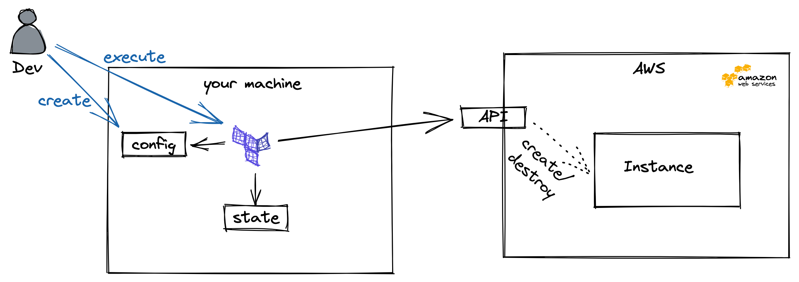

summary: Lab 1 - Terraform Introduction
id: virt-pt-terraform-intro
categories: MCCE-VIRT-PT
tags: supply-chain, aws, MCCE, virt-pt
status: Published
authors: Thomas Schuetz

# VIRT Lab 1 - Terraform Introduction
<!-- ------------------------ -->


## Overview

### What You’ll Learn



* Install your first virtual machine in terraform
* Destroy your first virtual machine in terraform

## Install Terraform
In the future, it will be more comfortable if you're able to use terraform from your PC and IDE.

To install terraform, refer to the respective documentation [here](https://learn.hashicorp.com/tutorials/terraform/install-cli)


## Get your AWS Configuration
* In the AWS Acedemy
  * Click on AWS Details
  * Show AWS CLI Credentials and copy them
  
* Copy them to your machine ~/.aws/credentials
* Terraform is able to use them -> see https://registry.terraform.io/providers/hashicorp/aws/latest/docs

## Create your first terraform configuration
* Create a directory, where you want to store your configuration
* Open an IDE of your choice and open this directory

### Provider configuration
* Create a file called `provider.tf` in your directory
* Copy the following block in the file
```terraform
provider "aws" {
  region = "us-east-1"
}
```
* This should be enough to run our first terraform command
```
terraform init
```

* This leads to the following output
```
Initializing the backend...

Initializing provider plugins...
- Finding latest version of hashicorp/aws...
- Installing hashicorp/aws v3.61.0...
- Installed hashicorp/aws v3.61.0 (signed by HashiCorp)

Terraform has created a lock file .terraform.lock.hcl to record the provider
selections it made above. Include this file in your version control repository
so that Terraform can guarantee to make the same selections by default when
you run "terraform init" in the future.

Terraform has been successfully initialized!

You may now begin working with Terraform. Try running "terraform plan" to see
any changes that are required for your infrastructure. All Terraform commands
should now work.

If you ever set or change modules or backend configuration for Terraform,
rerun this command to reinitialize your working directory. If you forget, other
commands will detect it and remind you to do so if necessary.
```

<aside class="positive">
- Using this step, terraform initialized its (local) state and downloaded the provider from the terraform registry
</aside>

In the second step, we will try to create a virtual instance ...

## Running a Virtual Instance

To do so, we'll create a second file called `main.tf`. Furthermore, we copy the following configuration in this file:
```terraform
data "aws_ami" "amazon-linux-2" {
  most_recent = true

  owners = [ "amazon" ]

  filter {
    name   = "name"
    values = ["amzn2-ami-hvm*"]
  }
}

resource "aws_instance" "web" {
  ami           = data.aws_ami.amazon-linux-2.id
  instance_type = "t2.micro"

  tags = {
    Name = "My-First-Terraform-Machine"
  }
}
```

**[Data Sources](https://www.terraform.io/docs/language/data-sources/index.html)**
are here to get configurations from your cloud provider, but will change nothing and are used for referencing in other objects 

**[Resources](https://www.terraform.io/docs/language/resources/index.html)**
are objects you are managing with terraform 

<aside class="negative">
- As you see in above_s configuration, you might need some more detailed configuration. Above's ami data source is only needed for getting the ami-id for this machine.
</aside>

* Now we could try to find out what this would lead to
* Change to your terraform directory in the shell and execute:
```
terraform plan
```

* You get some output about the things which would happen now, most probably you'll see that one instance will be created
* If you are happy with that, apply this configuration
```
terraform apply
```

* You see the same output as before and get prompted if you really want to do this, accept with "yes"
* After a short period of time, you'll see the following output

```

Plan: 1 to add, 0 to change, 0 to destroy.

Do you want to perform these actions?
  Terraform will perform the actions described above.
  Only 'yes' will be accepted to approve.

  Enter a value: yes

aws_instance.web: Creating...
aws_instance.web: Still creating... [10s elapsed]
aws_instance.web: Still creating... [20s elapsed]
aws_instance.web: Still creating... [30s elapsed]
aws_instance.web: Still creating... [40s elapsed]
aws_instance.web: Creation complete after 50s [id=i-06c97d9f8aee342a2]

Apply complete! Resources: 1 added, 0 changed, 0 destroyed.
```

* You will see the new instance now in your AWS Console
  

<aside class="positive">
- You created your first AWS Instance with Terraform
</aside>

## Deleting this instance
* After some time you might want to spin down your infrastructure (thing of demos for courses)
* You can simply tear it down by typing
```
terraform destroy
```
* The tool will ask you if you are sure that you want to remove your instance
* Type yes
* After some time you see the following output:
```
Plan: 0 to add, 0 to change, 1 to destroy.

Do you really want to destroy all resources?
  Terraform will destroy all your managed infrastructure, as shown above.
  There is no undo. Only 'yes' will be accepted to confirm.

  Enter a value: yes

aws_instance.web: Destroying... [id=i-06c97d9f8aee342a2]
aws_instance.web: Still destroying... [id=i-06c97d9f8aee342a2, 10s elapsed]
aws_instance.web: Still destroying... [id=i-06c97d9f8aee342a2, 20s elapsed]
aws_instance.web: Still destroying... [id=i-06c97d9f8aee342a2, 30s elapsed]
aws_instance.web: Still destroying... [id=i-06c97d9f8aee342a2, 40s elapsed]
aws_instance.web: Destruction complete after 44s

Destroy complete! Resources: 1 destroyed.
```
* If you take a look on the AWS Console, the Instance should be terminated

<aside class="positive">
- You deleted your first AWS Instance with Terraform, you made your first steps in Infrastructure-as-Code
</aside>