summary: BITI IPM Lab - Compute
id: biti-ipm-compute-windows-lab
categories: windows
tags: ipm, compute, cpu, BITI, introduction
status: Published
authors: Roland Pellegrini

# BITI IPM Lab - Compute

<!-- ------------------------ -->

## Before You Begin

### What You’ll Learn

In this codelab you will learn

- how to get information about the CPU.
- how to monitor CPU with Windows Tools.

### What You'll need

#### Guest operation system (Guest OS)

This is the OS of the virtual machine. This will be Microsoft Windows.

<aside class="negative">
Important note: All codelabs for Microsoft Windows are tested on Windows 10 but should also work on Windows 11. 
</aside>

#### Administators privileges

By default, administrator privileges are required on the Host OS to install additional software. Make sure that you have the required permissions.

For the Guest OS, you will create and manage your own users. These users will therefore be different from the Host's user administration.

## CPU Information

### What You will learn:

You can use one of the following commands to find some information about the physical CPUs (pCPU) including all cores on Windows:

- msinfo32 application
- systeminfo command
- wmic command
- Windows Registry

## msinfo32

### Description

The tool **msinfo32** is a built-in system profiler for Microsoft Windows which collects and displays system information about the the Operating systems, hard- and software.

### Sample code

To launch **msinfo32**, simple press the **Win+R** keys, type `msinfo32` and click the **OK**-button.

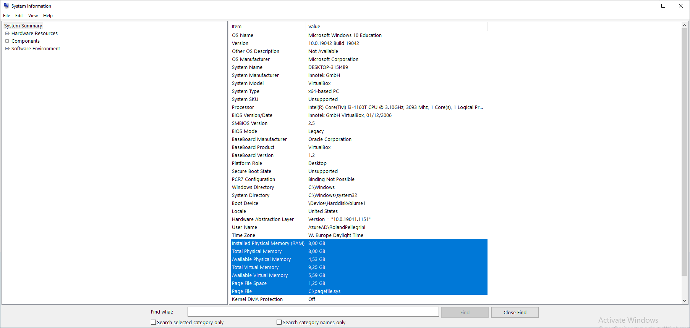

Details about the CPU can be found in the System Summary section at the Processor value in the right pane.

## Systeminfo

### Description

The command-line tools **systeminfo** displays detailed configuration information about a computer and its operating system, including system configuration, security information, product details, and hardware properties.

### Sample code

- Launch Windows PowerShell as an administrator and enter the following command:

```
systeminfo
```

- The Windows PowerShell window displays some information about the processor on this computer.

```
--More--
Processor(s):              1 Processor(s) Installed.
                           [01]: Intel64 Family 6 Model 60 Stepping 3 GenuineIntel ~3093 Mhz
--More--
```

## wmic

### Description

WMI (Windows Management Instrumentation) is a programming interface that can be used to capture many aspects of Windows operating systems. This ranges from hardware, operating system settings, performance data to installed applications. WMI allows to read and changed values. It also allows the execution of methods and functions.

WMIC stands for WMI Command.

### Sample code

- Open a command prompt.
- Execute the following command:

```
wmic cpu get caption,deviceid,name,numberofcores,maxclockspeed,status
```

<aside class="negative">
Note: don't insert spaces between semicolon and field name.
</aside>
### Sample output

- The command produces the following output:

```
Caption                               DeviceID  MaxClockSpeed  Name                                      NumberOfCores  Status
Intel64 Family 6 Model 60 Stepping 3  CPU0      3093           Intel(R) Core(TM) i3-4160T CPU @ 3.10GHz  2              OK
```

## Windows Registry

### Description

The **Windows Registry** is a database of information, settings, options and other values for software and hardware. The registry is installed on all versions of Microsoft Windows operating systems. The Windows Registry helps the operating system to manage the computer, it helps programs to use the resources, and it provides a location for keeping custom settings you make in both Windows and your programs.

### Sample code

- To launch **Windows Registry**, simple press the **Win+R** keys, type `regedit` and click the **OK**-button. This will lauch the Windows Registry Editor. Allow `User Account Control` with **Yes** when prompted.
- Browse to the Windows Registry Key named **Computer\HKEY_LOCAL_MACHINE\HARDWARE\DESCRIPTION\System\CentralProcessor**.
- Click on one of the subkeys to get information about the CPU (here 0).
  

## CPU Monitoring

### What You will learn:

You can use one of the following application to monitor the CPU on your Windows Host.

- Windows Task Manager (TaskMan)
- Windors Resource Monitor (ResMon)
- Windows Performance Monitor (PerfMon)

## Windows Task Manager

### Description

The **Windows Task Manager (Taskmon)** is a system tool found in all versions of Microsoft Windows platform's. It provides information about running applications, processes, and services, as well as computer performance, network activity, and memory information. There are two views for the Task Manager: Simplified and Advanced.

### Sample code

To use **Taskmon**, open "Start", do a search for `taskman`, and confirm the result. Or do a right-click on the Windows Taskbar and select `Task Manager` from the menu.


Microsoft improves the Task Manager between each version of Windows. Currently, Taskmon under Windows 11 has a redesigned look and some new features.Here is a list of running processes.
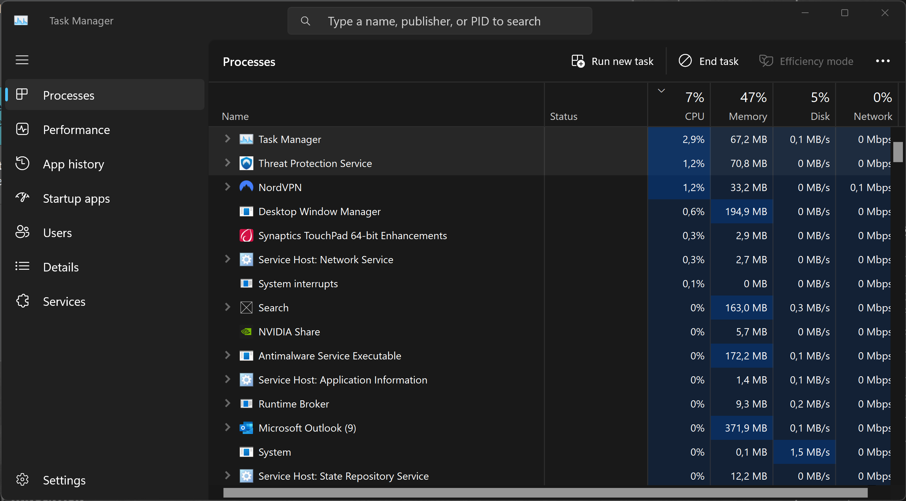

And here is a smart overview of the current performance.
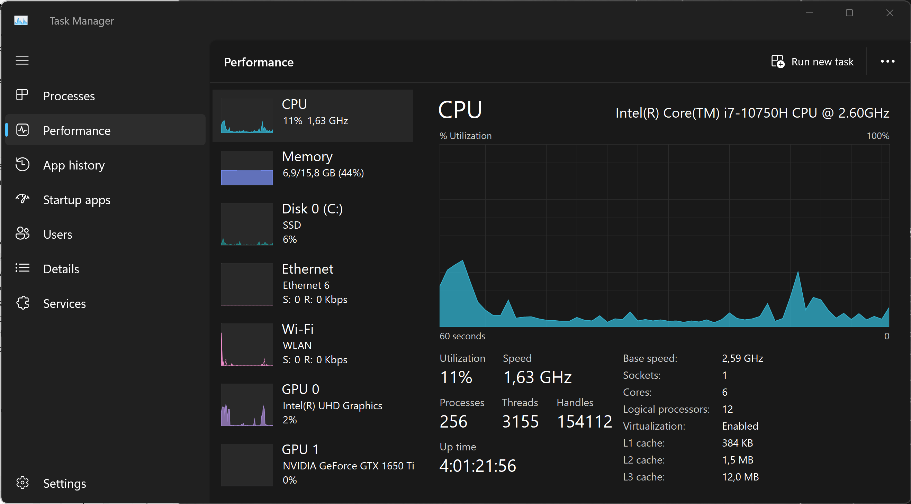

Learn more about the Task Manager from [Microsoft Learn](https://learn.microsoft.com/en-us/shows/inside/task-manager) or from [LifeWire](https://www.lifewire.com/task-manager-2626025#toc-task-manager-walkthrough).

## Windows Resource Monitor

### Description

The **Windows Resource Monitor (Resmon)** is a system application included in Windows Vista and later versions of Windows that allows users to look at the presence and allocation of resources on a computer.

The **Windows Task Manager** can best be described as a tool that runs `on` the surface. It lists processes and services, and general resource usage. In contrast, the **Resource Monitor** gives you the option to look `under` the surface to get more information that the Task Manager does not provide.

The Windows Resource Monitor can be used to determine extensive and detailed information about the current performance and resource consumption in real time. The program is therefore also suitable for error analysis. The view is divided into the following sections:

- Overview (CPU, disk, network, memory)
- CPU
- Memory
- Disk
- Network

### Sample code

To use **Resmon**, open Start, do a search for `resmon`, and confirm the result.


## Windows Performance Monitor

### Description

On Microsoft Windows, IT Administrators can use **Windows Performance Monitor** to analyze data, such as processor, hard drive, memory, and network usage.

### Sample code

To use **Perfmon**, open Start, do a search for `perfmon`, and confirm the result.


When you open the tool, the main page will show up with a brief overview, a system summary with real-time data about Memory, Network Interface, Physical Disk, and Processor Information. On the keft side, you will find the navigation pane with access to Monitoring Tools, Data Collector Sets, and Reports.<br>
<br>
When you switch to the Performance Monitor, you will see a screen with a single counter. This is typically the **Processor Time** counter, which displays the processor load.
<br>

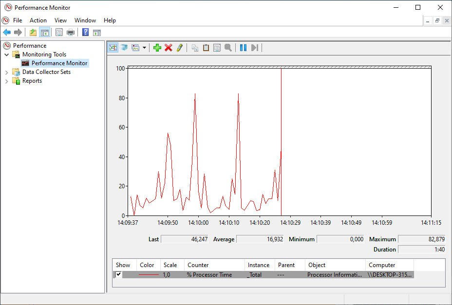

However, you can add a lot of other counters to monitor virtually anything on your computer. To add new counters to monitor applications and hardware performance on your computer, do the following steps:

- Click on the green **Plus** button above the Performance Monitor graph.
- Select **Local computer** (or the name of your computer) from the drop-down menu.
- Select and expand the category of the item you want to monitor.
- If applicable, select the instances you want to monitor (here: Processor). Click the **Add** button to add the new counters.
  
- Finally, click on the **OK** button to confirm. There you are !
  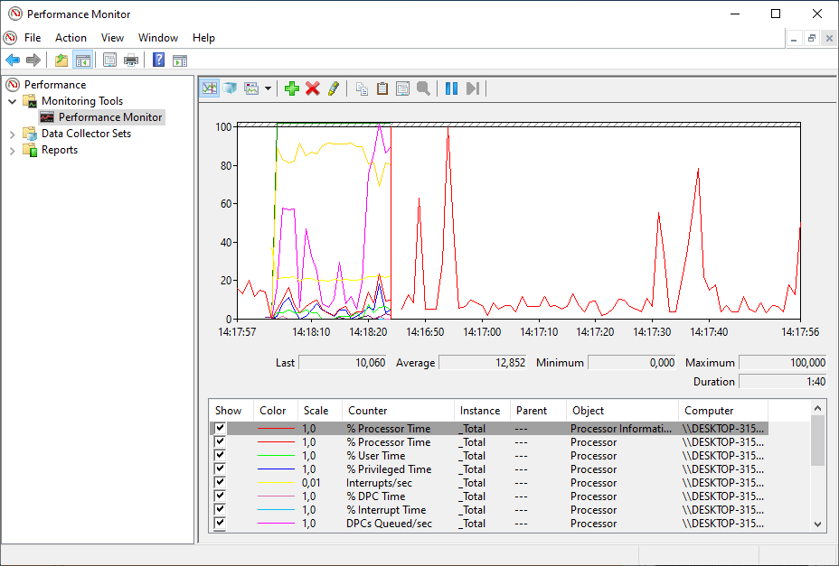

## Hands-On

### What you will learn:

In this codelab, you will learn

- how to use the dstat tool.
- how to generate workload.
- how to create a report file.

### What you will need:

In this codelab, you will need the following tools:

- PerfMon

### Scenario

In this codelab, the target is a virtual Machine with 2 CPU Cores and 8 GB RAM. The operating system is based on Windows 10 Educatuinm Version 10,0,19042 Build 19042. The VM is installed and running on the Linux-based Hypervisor VirtualBox, Version 6,1.16 r140961 (QT 5.11.3). THe HostOS is based on Debian with Linux Kernel version 4.19.0-17-amd64. The Host hardware is HP Prodesk 400 G1 DN with a Intel Core i3-4160T CPU@3.10GHz, 16GB RAM, and an Intenso SATA III Top 512GB.

### Test Run

To add Perfmon counters to monitor CPU Utilization please execute the following steps.

- Run Performance Monitor (**perfmon.exe**) as part of the Windows Administrative tools.
- Navigate to `Performance -> Data Collector Sets -> User Defined`.
- In the right hand pane, do a right click and Select `New - > Data Collector Set`.
- Provide a friendly name (i.e. Task Set).
  
- Click on **Create Manually (Advanced)**.
- Click **Next**.
- Under **Create Data Logs** select `Performance Counter`.
  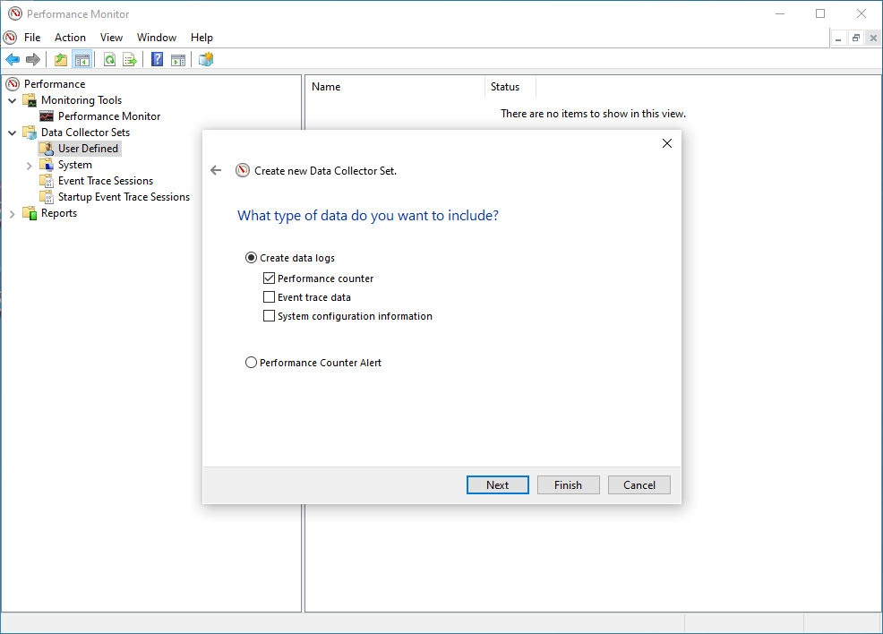
- Click on **Finish**.

The data set (i.e. Task Set) should now appear in the right hand pane.

- Double click on the data set (ie Task Set).
- `DataCollector01` should appear in the right hand pane.
  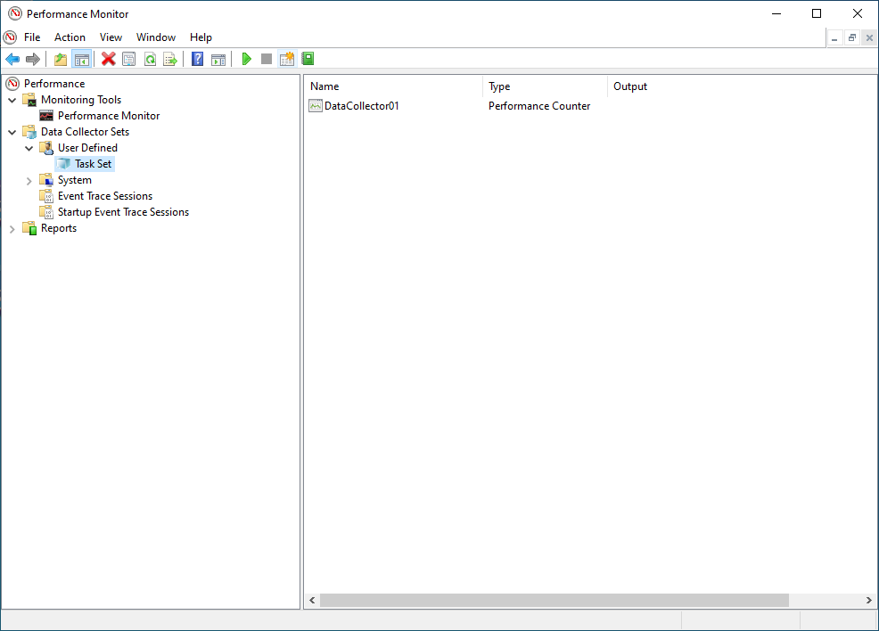
- Double click on the **DataCollector01**.
- In the `Performance Counters` tab, click on **Add**.  
  
- A list of the available counters appears on the screen, Navigate to `Processor` and mark it (do NOT expand the list). Under `Instances of selected objects`, select `0` (this is the first processor) and click on **Add>>**.

Next, you will see something like the following in the `Added counters` window:
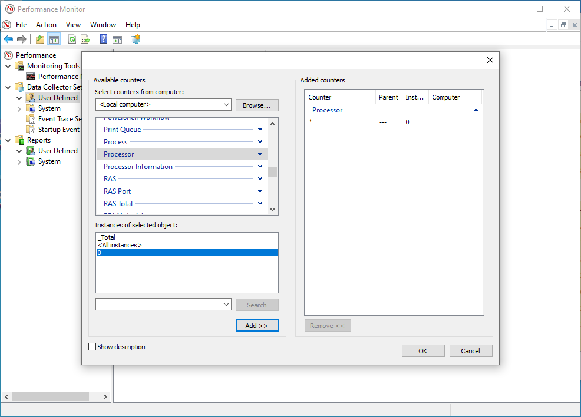

- Click on **OK** to return to the `DataCollector01` Properties screen.
- Leave the other values at default settings - e.g. Log Format set to `Binary` and Sample Interval set to `15` seconds. Just go ahead and click on **OK**.

Congrats, you have created the basic dataset. But we're not done yet.

The next steps are:
- The data set (ie Task Set) is displayed in the left hand pane. Do a **right click** and select `Properties`.
- The `DataSet Properties` includes a number of tabs.  
  
  - Use the *General* tab to set user credentials with the relevant privileges to run the perfmon (By default this is set to SYSTEM)
  - Use the *Directory* tab to set the data path of where you would like to store the logs files (by default this is set to the %systemdrive% - ie C:\) we would recoomend that the log files are stored on a drive which is not being monitored as this will skew the statistics.
  - Use the *Schedule* tab to Set the days to run and the time to commence collection. This would be specific to the customers working practices, for example if the issue under investigation is seen commonly at the start of normal office hours the schedule should be set for Monday - Friday commencing at 09:00am
  - Use the *Stop Condition* to set the parameters to stop (ie the Overall Duration of monitoring is 8 hours).
- Click on **OK** when all required parameters are configured.
- You can start data collection by selecting the DataSet (ie Task Set) with a right click to open the context menu. 
- Click on **Start** inside the context menu.
  
- You can stop data collection by selecting the DataSet (ie Task Set) with a right click again. Click on **Stop** inside the context menu.
  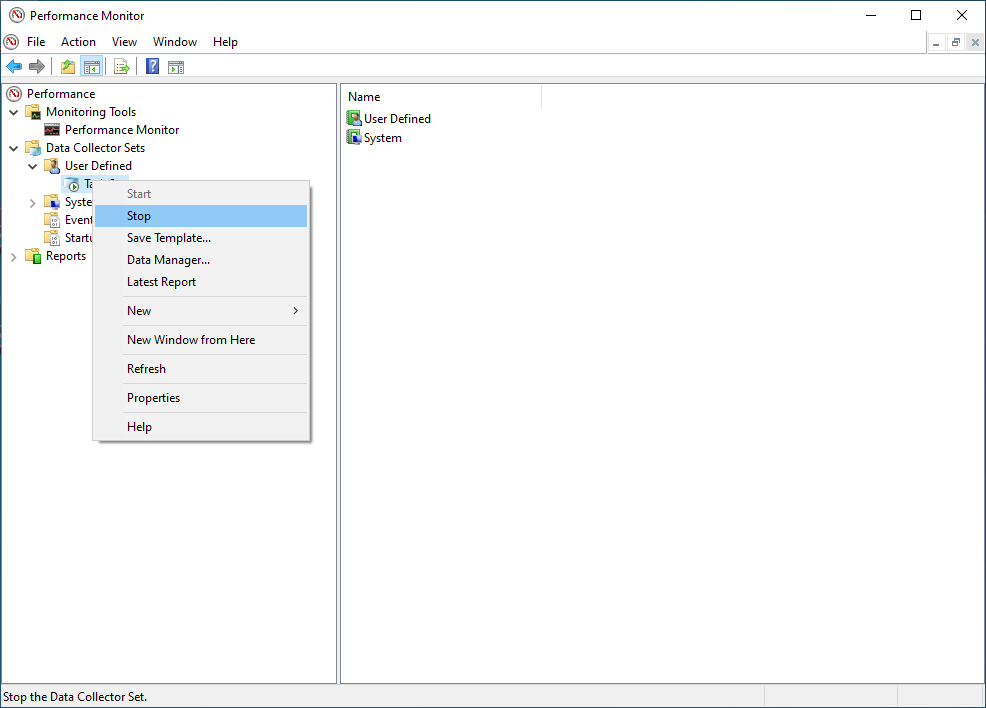
- Navigate to `Performance -> Reports -> User Defined --> Data set` (ie Task Set).
- Open the last recent report.
  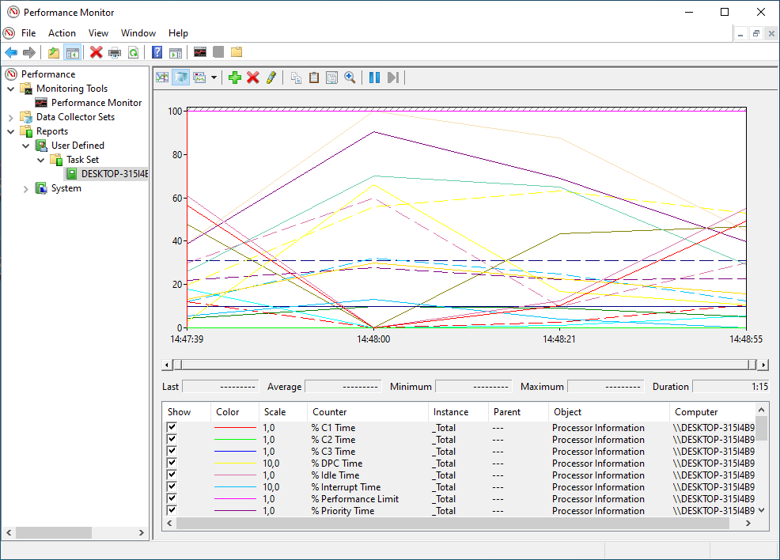
- You can change the graph type from `Line` to `Report` if you are a big fan of numbers.
  

### Clean Up

- Finally, delete the data collector set by clicking on the DataSet (ie Task Set) with a right click to open the context menu. Click on **Delete**.
  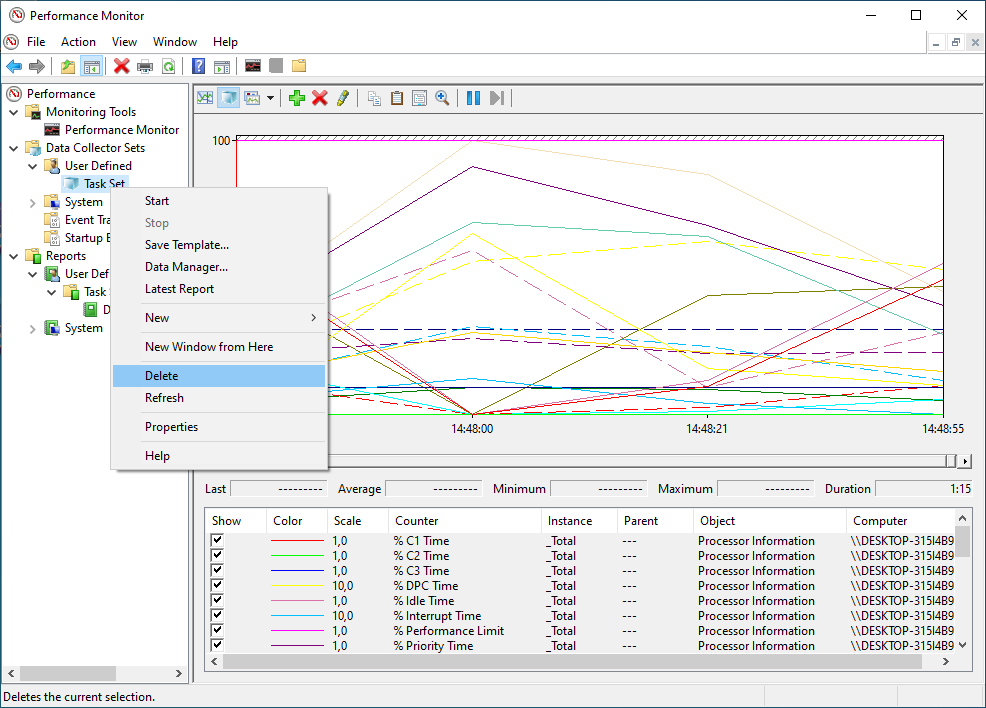
- Repeat the step above for all the other reports as well.

This is the end of the hands-on.
