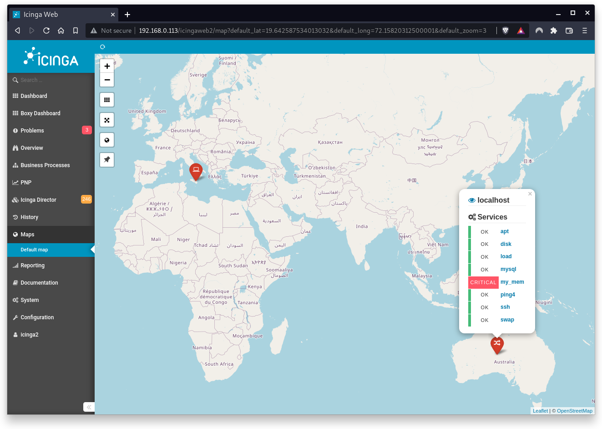

summary: BITI IPM Lab - Icinga Addons
id: biti-ipm-icinga-web2-modules
categories: icinga
tags: ipm, icinga, BITI, introduction
status: Draft
authors: Roland Pellegrini

# BITI IPM Lab - Icinga Addons
<!-- ------------------------ -->
## Before You Begin 

### What You’ll Learn

Icingaweb2 is a very modular web interface for Icinga2. Icinga is compatible with all plug-ins and the majority of add-ons written for Nagios.


Therefore, in this codelab you will learn

* how to install useful addons

Have fun!

###  Where You Can Look Up

The best source of documentation is the homepage of Icinga2. The latest documentation can be found [here](https://icinga.com/docs/icinga-2/latest/doc/13-addons/).

### What You'll need

#### Guest operation system (Guest OS)

This is the OS of the virtual machine. This will be Debian 11 (Bullseye).

#### Administators privileges

By default, administrator privileges are required on the Host OS to install additional software. Make sure that you have the required permissions.

For the Guest OS, you will create and manage your own users. These users will therefore be different from the Host's user administration. 

### Root privileges via sudo

In this codelab you have to work with root privileges. Therefore, a few words of caution: double check whatever you type and make backups whenever necessary.

Working with root privileges is quite easy. Open a terminal (a shell) and enter the following commmand:
```
sudo -s
```
Enter the password of the icinga user and voila:
```
root@server:/home/icinga#
```

Once you are root via sudo, it is no longer necessary to prepend the sudo command. Instead of `sudo ls -lisa /root/` you can also type `ls -lisa /root/` because you have root privileges already. However, all commands in this codelab will always start with `sudo` to remind you that you are working with root privileges.


<!-- ------------------------ -->

## Map

This community-based module displays host objects as markers on Openstreet Map. 

### Installation

```
sudo apt install icingaweb2-module-map
```

### Fix missing character set

The module requires the character set `latin1` otherwise it will pop up an error.

To add the character set, open the resource file of Icingaweb2 with the following command:
```
sudo nano /etc/icingaweb2/resources.ini
```

Now update (or add) the following line:

```
[icinga_ido]
charset = "latin1" <== ADD THIS
```

That's all here.

### Set Marker

Finally, we have to add coordinates to a host object in Icinga 2. The coordinate values are defined in the following format:

```
vars.geolocation = "<latitude>,<longitude>"
```

Next, open the file with an editor:
```
sudo nano /etc/icinga2/conf.d/hosts/localhost.conf
```

Add the following variables to the host object
```
object Host "localhost" {
    import "generic-host"
    address = "127.0.0.1"
    check_command = "hostalive"
    vars.geolocation = "-25.344857,131.0325171" <== ADD THIS (MUST)
    vars.map_icon = "host"                      <== ADD THIS (Optional)
}
```

As shown, you can add a custom attribute called `map_icon` to an object which is displayed on the marker.

Popular marker icons are:
* host (default)
* flapping
* wifi
* service
* tux
* win
* user
* dashboard
* configuration

### Restart Icinga2

After installing and configuring the map module, it is necessary to restart the Icinga2 service again and to check its status.
```
sudo systemctl restart icinga2
sudo systemctl status icinga2
```

Any problems? Try to fix them with appropriate tools.

### The result

That's it, Map is now ready for use. Once you enable the Host Map module, it will pop up in your menu in the Maps section.

Based on the coordinates and the marker icons, hosts will be displayed on the map. If you want to know more details about a host just click on the host marker. If you want to show the host in the detail view of the monitoring module just click on the eye icon.



The module provides more features:
* Control elements in the upper left corner of the map
* Filtering host objects via the Icingaweb2 filter system
* Dashboard integration
* Markers are grouped into clusters, depending on their location and the zoom level. 


## Cleanup

Congratulations !

You have successfully set up your first Icinga2 module.
