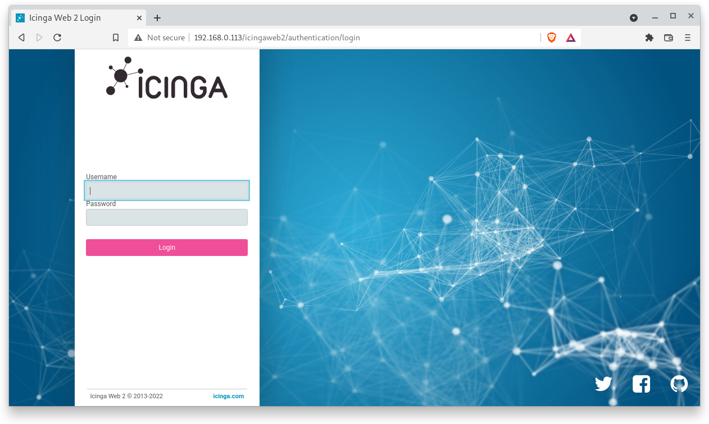
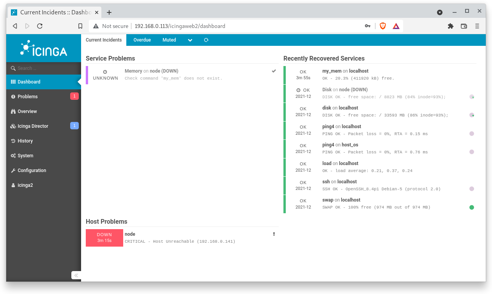
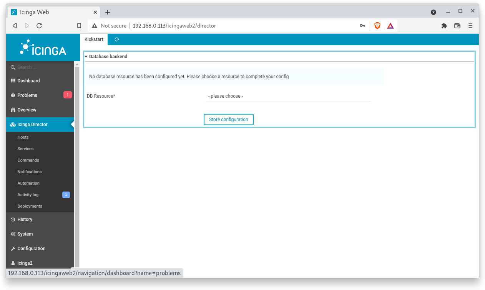
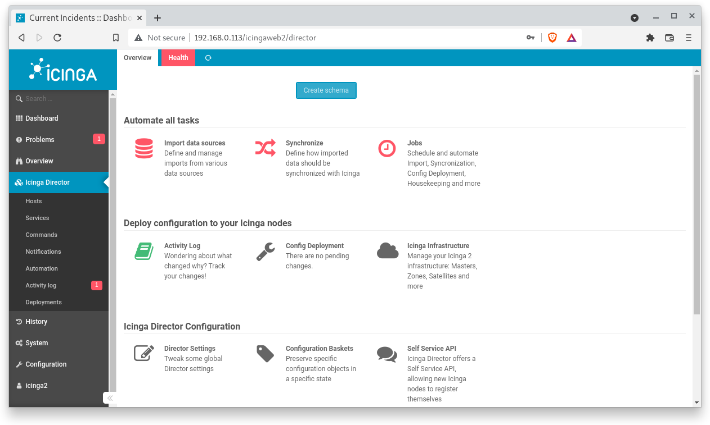
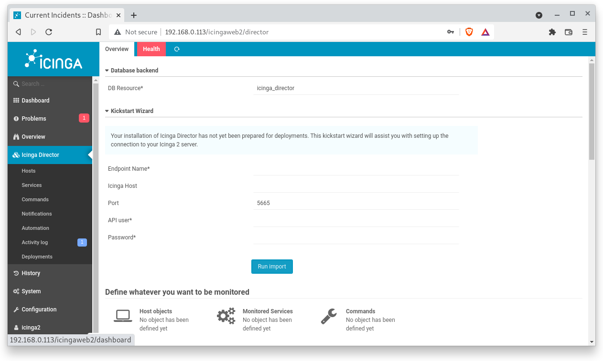
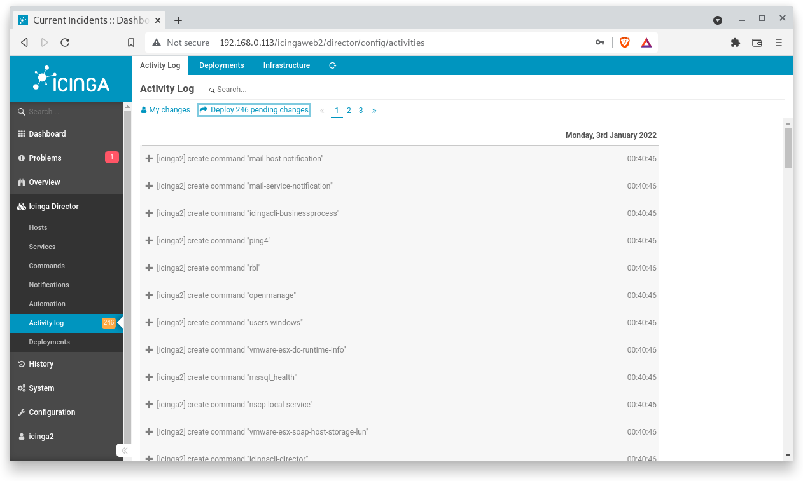

summary: BITI IPM Lab - Icinga Director Installation
id: biti-ipm-icinga-director-installation-lab
categories: icinga
tags: ipm, icinga, BITI, introduction
status: Draft
authors: Roland Pellegrini

# BITI IPM Lab - Icinga Director Installation

<!-- ------------------------ -->

## Before You Begin

### What You’ll Learn

Icinga2 Director is a module that is designed to make Icinga2 web configuration easier and faster. It helps less advanced users to add, monitor and delete hosts and services through a web interface which involves a simple point and click.

Icinga2 Director can also be a perfect tool to use when a user doesn’t have root access to the master server. With Icinga2 Director, you have the advantage of importing and syncing objects.

However, the Icinga2 Director requires advanced users to install it. That's you !

Therefore, in this codelab you will learn

- how to install Icinga2 Director

Good luck!

### Where You Can Look Up

The best source of documentation is the homepage of Icinga2. The latest documentation can be found [here](https://icinga.com/docs/icinga-2/latest/doc/02-installation/).

### What You'll need

#### Guest operation system (Guest OS)

This is the OS of the virtual machine. This will be Debian .

#### Administators privileges

By default, administrator privileges are required on the Host OS to install additional software. Make sure that you have the required permissions.

For the Guest OS, you will create and manage your own users. These users will therefore be different from the Host's user administration.

### Root privileges via sudo

In this codelab you have to work with root privileges. Therefore, a few words of caution: double check whatever you type and make backups whenever necessary.

Working with root privileges is quite easy. Open a terminal (a shell) and enter the following commmand:

```
sudo -s
```

Enter the password of the icinga user and voila:

```
root@server:/home/icinga#
```

Once you are root via sudo, it is no longer necessary to prepend the sudo command. Instead of `sudo ls -lisa /root/` you can also type `ls -lisa /root/` because you have root privileges already. However, all commands in this codelab will always start with `sudo` to remind you that you are working with root privileges.

<!-- ------------------------ -->

## System update

### Description

Run the following commands to update your system package repositories.

```
sudo apt update
sudo apt upgrade
```

<aside class="positive">
When using the sudo command, you will be prompted for your password.
</aside>

Depending on the package upgrades, it is useful to restart the system here.

<!-- ------------------------ -->

## Icinga2 Director

### Core Module

Now that Icinga 2 repos are available, you can install the corresponding module by executing the command below:

```
sudo apt install icingaweb2-module-director
```

### API User

It is necessary to create an API user with full privileges for Icinga2 Director. This allows the director to control the entire Icinga2 instance.

First, edit the file `api-users.conf` with an editor of your choice (here: nano).

```
sudo nano /etc/icinga2/conf.d/api-users.conf
```

Next, add the following content at the end of the file (without deleting other existing ApiUser objects):
```
object ApiUser "director" {
  password = "director"
  permissions = [ "*" ]
}
```

Quit the configuration file with `CTRL-X` and confirm with `y` to save all changes.

<aside class="negative">
Do not use this password in other systems or environments, especially not in a production system. We use this password to ensure a smooth installation process during the lecture and to eliminate potential sources of error. 
</aside>

Last, transfer the ownership.

```
sudo chown nagios:nagios /etc/icinga2/conf.d/
```

## Icinga2 Director Backend

### Database configuration

Sorry but true: you have to create another database and a db_user for Icinga2 Director.

First, log in to MariaDB shell with the following command:

```
sudo mysql -u root -p
```

Provide your root password (or simple press enter) and create a database and user for Icinga2 Director with the following commands:

```
CREATE DATABASE director CHARACTER SET 'utf8';
CREATE USER director@localhost IDENTIFIED BY 'director';
GRANT ALL ON director.* TO director@localhost;

```

<aside class="negative">
Warning: 
<br>
Do not use this password in other systems or environments, especially not in a production system. We use this password to ensure a smooth installation process during the lecture and to eliminate potential sources of error.
</aside>

<aside class="positive">
Icinga2 Director requires UTF-8 encoding for its database, otherwise it will not work properly.
</aside>

Run the following command to get a list of databases installed.
```
show databases;
```

Sample output:
```
+--------------------+
| Database           |
+--------------------+
| director           |
| icinga2            |
| icingaweb2         |
| information_schema |
| mysql              |
| performance_schema |
| sys                |
+--------------------+
```

Next, check if the newly created user exists:
```
select user from mysql.user;
```

Sample output:

```
+-------------+
| User        |
+-------------+
| director    |
| icinga2     |
| icingaweb2  |
| mariadb.sys |
| mysql       |
| root        |
+-------------+
```

Everything okay? Good. Now reload privileges tables with the following commands:

```
flush privileges;
quit
```

### Mangement configuration

Icinga Director needs a relational database (such as MySQL, MariaDB or PostgreSQL). Therefore, we need to tell Icingaweb2 how to connect to the Director's database.

First, open and edit the `resources.ini` file with an editor of your choise (here: nano):

```
sudo nano /etc/icingaweb2/resources.ini
```

Next, add the following content at the end of the file:
```
[icinga_director]
type = "db"
db = "mysql"
host = "localhost"
dbname = "director"
username = "director"
password = "director"
charset = "utf8"

```

<aside class="positive">
The director needs the charset UTF-8!
</aside>

Quit the configuration file with `CTRL-X` and confirm with `y` to save all changes.

<aside class="negative">
Warning: 
<br>
Do not use this password in other systems or environments, especially not in a production system. We use this password to ensure a smooth installation process during the lecture and to eliminate potential sources of error.
</aside>

### Restart Icinga2

On Debian, Icinga2 is started and enabled upon installation. However, after installing and configuring Icinga2 Director it is necessary to restart the Icinga2 service again and to check its status.

```
sudo systemctl restart icinga2
sudo systemctl status icinga2
```

Any problems? Try to fix them with appropriate tools.

## Icinga Web2 Frontend

### Icinga Web2 Login

Time to see the Director in action. 

Open the browser and point to the URL of the Icinga2 Web Inferface:

```
http://<ip-address-of-icinga>/icingaweb2
```

Enter the username and password from the previous codelabs.



### Icinga2 Director

The first thing you will notice are ... **problems**. Ignore them. Here, as shown in the screenshot below, one of the virtual machines is offline because it was turned off while installing the Icinga Director due to performance reasons.



The second thing you will notice is a new menu item called `Icinga Director`. Click on it and the director will guide you through the setup procedure.  

Next, the Director ask you for a database resource.


Where,

- `DB Resource` - icinga_director

<aside class="negative">
Warning: 
<br>
Be careful here. The setup will switch to the next screen immediately after selecting the Database resource.
</aside>

Next, the Director ask you to create a scheme.



Click on the `Create Scheme` button.

Next, the director wants you to run the `Kickstart wizard`. In simple terms: the director imports (=kickstarts, populates, seeds) data into the database we have created previously.



Where,
- `DB Resource` - icinga_director
- `Endpoint name` - ipm-server
- `Icinga Host` - your-server-ip-address (or FQDN)
- `Port` - 5665 (don't change it)
- `API-User` - director
- `Password` - director

Double-check your inputs. Click on the `Run Import` button to populate the database.

After populating the database, the Icinga2 Director is ready to configure hosts and services.


But let's check the log first.

### Activity Log

Director provides a nice activity log. Click on the "Activity log" menu to see a list of all past activities (around 200 or more).



Select one line of the activity history. A brief overview of the selected command is displayed in the right-hand window.


Did you notice the magnifier? You can search for logs. Try to find our custom check `my_mem`.

## In action

You can now try to setup your own monitoring solution with the Director. 

<aside class="negative">
Warning: 
<br>
Director is not allowed to modify existing configuration in /etc/icinga2.
</aside>

That means that you have to set up your Monitoring solution by yourself.

Here are some good practices:
- First, set up templates for Hosts and Services. Use the existing templates but with different names.
- Second, set up a specific host, and use `hostalive` as default check_command.
- Finally, set up a simple service such as ping4 and assign it as a regular check_command to your host.

<aside class="positive">
Tipp: 
<br>
Add, store, and deploy! That is the way.
</aside>

## Cleanup

Congratulations !

You have successfully set up Icinga2 Director.
