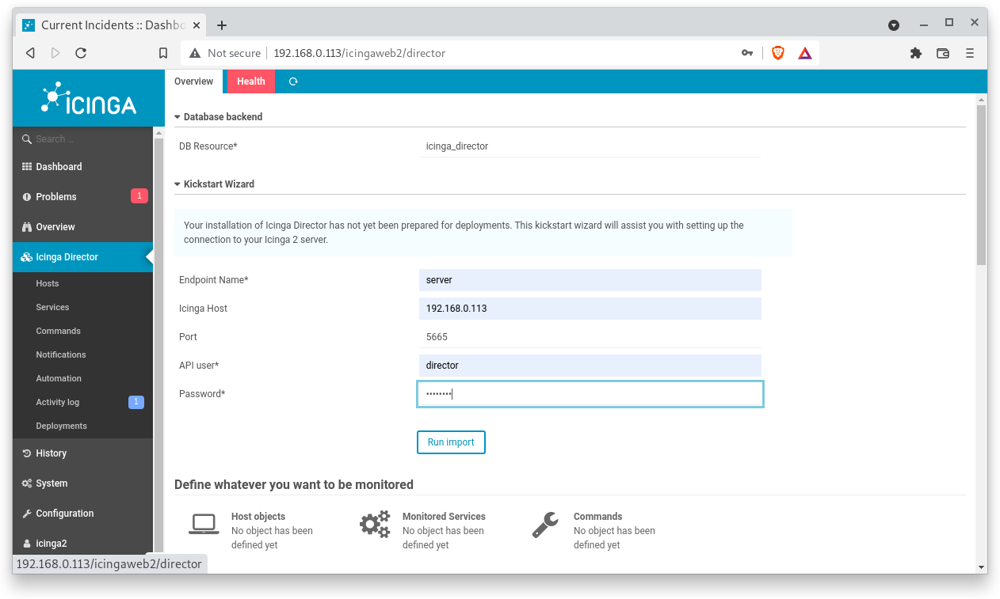
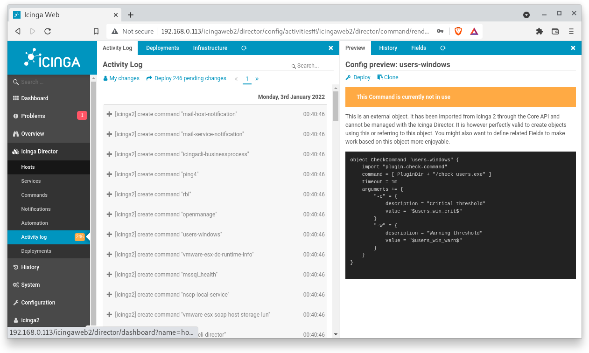

summary: BITI IPM Lab - Icinga Director Installation
id: biti-ipm-icinga-director-installation-lab
categories: icinga
tags: ipm, icinga, BITI, introduction
status: Draft
authors: Roland Pellegrini

# BITI IPM Lab - Icinga Director Installation

<!-- ------------------------ -->

## Before You Begin

### What You’ll Learn

Icinga2 Director is a module that is designed to make Icinga2 web configuration easier and faster. It helps less advanced users to add, monitor and delete hosts and services through a web interface which involves a simple point and click.

Icinga2 Director can also be a perfect tool to use when a user doesn’t have root access to the master server. With Icinga2 Director, you have the advantage of importing and syncing objects.

However, the Icinga2 Director requires advanced users to install it. That's you !

Therefore, in this codelab you will learn

- how to install Icinga2 Director

Good luck!

### Where You Can Look Up

The best source of documentation is the homepage of Icinga2. The latest documentation can be found [here](https://icinga.com/docs/icinga-2/latest/doc/02-installation/).

### What You'll need

#### Guest operation system (Guest OS)

This is the OS of the virtual machine. This will be Debian .

#### Administators privileges

By default, administrator privileges are required on the Host OS to install additional software. Make sure that you have the required permissions.

For the Guest OS, you will create and manage your own users. These users will therefore be different from the Host's user administration.

### Root privileges via sudo

In this codelab you have to work with root privileges. Therefore, a few words of caution: double check whatever you type and make backups whenever necessary.

Working with root privileges is quite easy. Open a terminal (a shell) and enter the following commmand:

```
sudo -s
```

Enter the password of the icinga user and voila:

```
root@server:/home/icinga#
```

Once you are root via sudo, it is no longer necessary to prepend the sudo command. Instead of `sudo ls -lisa /root/` you can also type `ls -lisa /root/` because you have root privileges already. However, all commands in this codelab will always start with `sudo` to remind you that you are working with root privileges.

<!-- ------------------------ -->

## System update

### Description

Run the following commands to update your system package repositories.

```
sudo apt update
sudo apt upgrade
```

<aside class="positive">
When using the sudo command, you will be prompted for your password.
</aside>

Depending on the package upgrades, it is useful to restart the system here.

<!-- ------------------------ -->

## Icinga2 Director

### Core App

Now that Icinga 2 repos are in place, you can install the Icinga2 Director by running the command below:

```
sudo apt install icingaweb2-module-director
```

### API User

It is necessary to create a API user with full privileges for Icinga2 Director. Those privileges are necessary as Icinga2 Director should be able to control the complete Icinga2 instance.

Configure the ApiUser file at `/etc/icinga2/conf.d/api-users.conf` with an editor of your choice (here nano).

```
sudo nano /etc/icinga2/conf.d/api-users.conf
```

Now add the following information (without deleting existing ApiUser objects) at the end of the file:

```
object ApiUser "director" {
  password = "director"
  permissions = [ "*" ]
}
```

<aside class="negative">
Do not use this password in other systems or environments, especially not in a production system. We use this password to ensure a smooth installation process during the lecture and to eliminate potential sources of error. 
</aside>

## Icinga2 Director Backend

### Database configuration

Sorry but true: you have to create another database and a db_user for Icinga2 Director.

First, log in to MariaDB shell with the following command:

```
sudo mysql -u root -p
```

Provide your root password (or simple press enter) and create a database and user for Icinga2 Director with the following commands:

```
CREATE DATABASE director CHARACTER SET 'utf8';
CREATE USER director@localhost IDENTIFIED BY 'director';
GRANT ALL ON director.* TO director@localhost;

```

<aside class="negative">
Warning: 
<br>
Do not use this password in other systems or environments, especially not in a production system. We use this password to ensure a smooth installation process during the lecture and to eliminate potential sources of error.
</aside>

<aside class="positive">
Icinga2 Director requires UTF-8 encoding for its database, otherwise it will not work properly.
</aside>

Reload privileges tables with the following commands:

```
flush privileges;
quit
```

### Mangement configuration

Icinga Director uses a relational database such as MySQL, MariaDB or PostgreSQL. We use MySQL/MariaDB. Therefore, we have to tell Icingaweb2 how to connect need to the Director's database.

For this purpose, open the file `/etc/icingaweb2/resources.ini`` with an editor of your choise (here nano):

```
sudo nano /etc/icingaweb2/resources.ini
```

Remember to use the password you used during creation of the database user and also the type of database you are using. Also use the "utf8" for charset (important). Now add the following information to the end of the file but leave the rest untouched:

```
[icinga_director]
type = "db"
db = "mysql"
host = "localhost"
dbname = "director"
username = "director"
password = "director"
charset = "utf8"
```

### Restart Icinga2

On Debian, Icinga2 is started and enabled upon installation. However, after installing and configuring Icinga2 Director it is necessary to restart the Icinga2 service again and to check its status.

```
sudo systemctl restart icinga2
sudo systemctl status icinga2
```

Any problems? Try to fix them with appropriate tools.

## Icinga Web2 Frontend

### Icinga Web2 Login

Time to log in. Open the browser and point to the URL of the Icinga2 Web Inferface (https://your-server-ip-address/icingaweb2).
Enter the username and password from the previous codelabs.


### Icinga2 Director

The first thing you will notice are problems. In most cases, you can simple ignore them. Here, as shown in the figure below, one of the virtual machines (hostname = node) is offline because it was turned off while installing the Icinga Director due to performance reasons.


The second thing you will notice is a new menu item called "Icinga Director. Click on the item. The director guides you through the setup procedure. Select `icinga_director` as DB Resource.

<aside class="negative">
Be careful here: The setup will switch to the next screen immediately after selecting the icinga_directory. There is no way back!
</aside>


Next, the director wants to you to create the database schema. In other words: no need to execute a sql script manually! Press on the button `Create schema`.


Next, the director wants you to run the `Kickstart wizard`. In simple terms: the director imports (=kickstarts or seeds) data into the database we have created.


For this, enter the following information:

- Endpoint name - server
- Icinga Host - your-server-ip-address
- Port - don't change it, 5665 is fine
- API-User - director
- Password - director

Double-check your inputs. Click on `Run Import` to seed the database.



After a successful kickstart, the Icinga2 Director is ready to configure hosts and services.


### Activity Log

Changes of all kinds can be easily tracked via the Activity Log. Which object was changed, what was the reason of the change, when was it made and by whom? Use the search function to browse through the activity log.

Click on the 'Activity Log' menu and a list of all past activities will be displayed.


Click on a line of the activity log. A brief overview of the selected command appears in the right window.



## Cleanup

Congratulations !

You have successfully set up Icinga2 Director.
