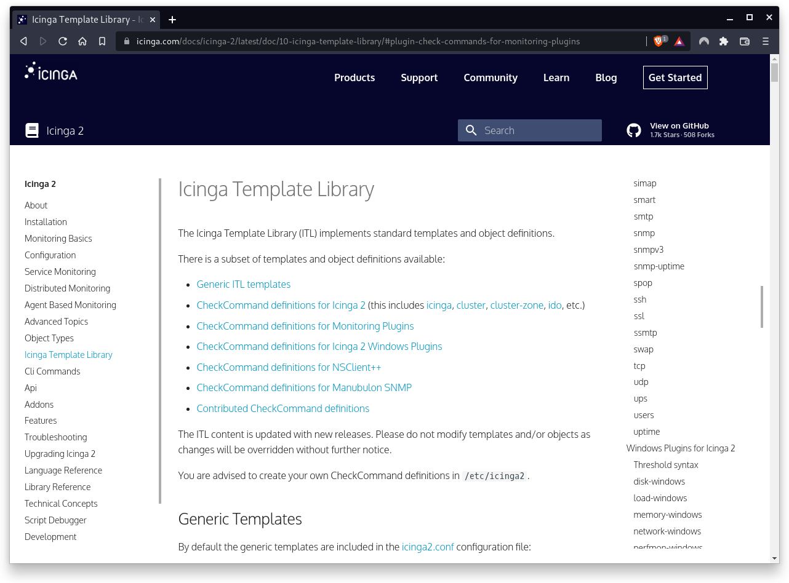
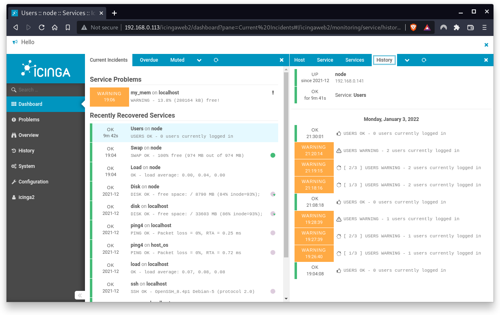

summary: BITI IPM Lab - Icinga Template Library
id: biti-ipm-icinga-itl-lab
categories: icinga
tags: ipm, icinga, BITI, introduction
status: Draft
authors: Roland Pellegrini

# BITI IPM Lab - Icinga Template Library
<!-- ------------------------ -->
## Before You Begin 

### What You’ll Learn

The ITL is a collection of templates and check commands. Check commands control the invocation of plugins in Icinga 2.

A plugin is a program that uses its own logic to determine the status of a service or host. 

The check command to apply is specified in a service definition. This determines which plugin will be executed to perform a check on that service.

In this codelab you will learn

* how to use check commands

###  Where You Can Look Up

The best source of documentation is the homepage of Icinga2. The latest documentation can be found [here](https://icinga.com/docs/icinga-2/latest/doc/01-about/).

### What You'll need

#### Guest operation system (Guest OS)

This is the OS of the virtual machine. This will be Debian 11 (Bullseye).

#### Administators privileges

By default, administrator privileges are required on the Host OS to install additional software. Make sure that you have the required permissions.

For the Guest OS, you will create and manage your own users. These users will therefore be different from the Host's user administration. 

### Root privileges via sudo

In this codelab you have to work with root privileges. Therefore, a few words of caution: double check whatever you type and make backups whenever necessary.

Working with root privileges is quite easy. Open a terminal (a shell) and enter the following commmand:
```
sudo -s
```
Enter the password of the icinga user and voila:
```
root@server:/home/icinga#
```

Once you are root via sudo, it is no longer necessary to prepend the sudo command. Instead of `sudo ls -lisa /root/` you can also type `ls -lisa /root/` because you have root privileges already. However, all commands in this codelab will always start with `sudo` to remind you that you are working with root privileges.

<!-- ------------------------ -->


## Icinga Template Library

### Introduction

The documentation of the ITL can be found [here](https://icinga.com/docs/icinga-2/latest/doc/10-icinga-template-library).

The documentation provides an overview of subsets of templates and object definitions.



As an example, scroll down to the `check_user` plugin.


This section gives you a short description of the `check_users` plugin. Here, the `check_users` plugin checks the number of users currently logged in on the local system and generates an error if the number exceeds the thresholds specified. The plugin therefore accepts parameters which can be accessed as runtime macros by the executed command.

The check_users plugin provides the following parameters:
* users_wgreater - Optional. The user count warning threshold. Defaults to 20.
* users_cgreater - Optional. The user count critical threshold. Defaults to 50.


## Command-Line

When you install Icinga2 on your computer, all check commands can be found in `/usr/lib/nagios/plugins/`.

Please run the following command to get an overview of the `check_users` plugin and its parameters: 
```
sudo /usr/lib/nagios/plugins/check_users -h
```

The plugin provides a detailed help screen.
```
check_users v2.3.1 (monitoring-plugins 2.3.1)
Copyright (c) 1999 Ethan Galstad
Copyright (c) 2000-2007 Monitoring Plugins Development Team
	<devel@monitoring-plugins.org>

This plugin checks the number of users currently logged in on the local
system and generates an error if the number exceeds the thresholds specified.


Usage:
check_users -w <users> -c <users>

Options:
 -h, --help
    Print detailed help screen
 -V, --version
    Print version information
 --extra-opts=[section][@file]
    Read options from an ini file. See
    https://www.monitoring-plugins.org/doc/extra-opts.html
    for usage and examples.
 -w, --warning=INTEGER
    Set WARNING status if more than INTEGER users are logged in
 -c, --critical=INTEGER
    Set CRITICAL status if more than INTEGER users are logged in

Send email to help@monitoring-plugins.org if you have questions regarding
use of this software. To submit patches or suggest improvements, send email
to devel@monitoring-plugins.org
```

Run the following command to check the number of users logged-in.
```
sudo /usr/lib/nagios/plugins/check_users -w 0 -c 0
```

Note that you must pass all parameters here. All thresholds are set to zero, which means that the command will definitely print an error message if one or more users are logged in. The output of the command looks like this:
```
USERS CRITICAL - 1 users currently logged in | users=1;0;0;0
```
As expected, the plugin generates a critical message because the number of logged-in users exceeds the threshold of zero (0). Use different thresholds to generate CRITICAL, WARNING and OK messages.

<aside class="positive">
It is a good practice to test check_commands on the command line first. This helps the Icinga2 administrators to understand how the check_commands have to be used and how they are applied in configuration files.
</aside>

## Service Configuration

In a next step, we will extend the `check_user` plugin in our service definition.
Open the `services.config` file with an editor of your choice (here nano).

```
sudo nano /etc/icinga2/zones.d/master/services.conf
```

Scroll down to the `Users` Service (or add it if the section does not exist) and add the following line:
```
apply Service "Users" {
  check_command = "users"
  command_endpoint = host.vars.client_endpoint
  vars.users_wgreater = 0  <=== ADD THIS
  assign where host.vars.client_endpoint
}
```

Now restart the Icinga2 service to apply the changes:

```
sudo systemctl restart icinga2
```

<aside class="negative">
Do you encounter any problems here? First try to fix the problem yourself! Use an appropriate tool to verify if the configuration syntax is error-free.
</aside>


Now go back to the Icinga2 Web Interface and check if User problems occur:


If not, log in to Icinga node client via Console or via SSH. After a couple of minutes, the following service problem shows up on the screen.


In this case, the agent on the node client has identified the two users currently logged in and generated a WARNING status. The message disappears after a few minutes, once all users have logged out again.


Even if past incidents disappear, however, they are stored in Icinga2 and can be retrieved at any time. Simply click on `Users` in the "Recently Restored Services" section and then select the `History` tab. 



The History tab shows details of all past incidents related to the Check User command. Similary, you can check the history of other incidents as well.

## Hands-on

### What you will learn:

This hands-on differs from other lessons. This hands-on wants you to explore some of the check_commands which are provided by Icinga2 by default.

In this codelab, you will learn 

* how to use more check commands on the command line
* how to use them as services
* how useful backups are!
* 

The objective of this hands-on is to get some practice when working with Icinga2 and its configuration files.

### What you will need:

In this codelab, you will need a running Icinga2 server.

### The assignment

* Go to `/usr/lib/nagios/plugins/` and pick some random check_commands.
* Run them on the commandline first to get an idea how they work and what parameters they provide.
* Edit the files `/etc/icinga2/zones.d/master/services.conf` (agendbased) and `/etc/icinga2/conf.d/hosts/localhost.conf` (agentless) and add some of the check_commands. Use the online [documentation](https://icinga.com/docs/icinga-2/latest/doc/01-about/) to get information and more details about the check_commands. Finally, update some parameters of existing commands.
* Watch how Icinga2 reacts on the changes you made and play around with different settings.

### Useful check_commands

Here is a list of some checks you might test:

* check_mysql (localhost only because the database is installed on your Icinga2 server)
* check_apt (can be installed on both, localhost and node)
* check_http (let's go and check some external websites)
* check_procs (can be installed on both, localhost and node)
* check_tcp (hmmm, which service is waiting for incoming tcp traffic?)
* check_swap (already installed so use different parameters)
* check_disk (already installed so use different parameters)

And much much more. Have fun!

## Cleanup

Congratulations !

You have successfully implemented some ITL plugins.
