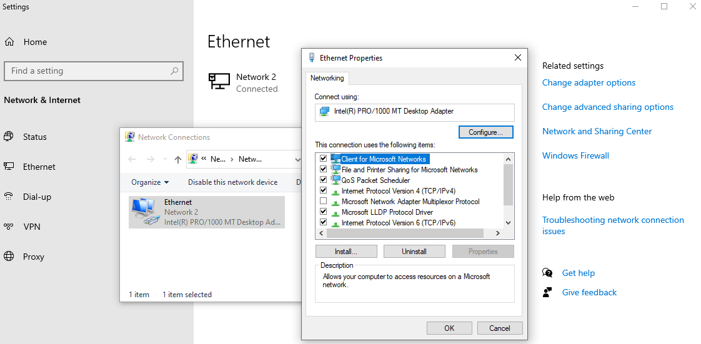
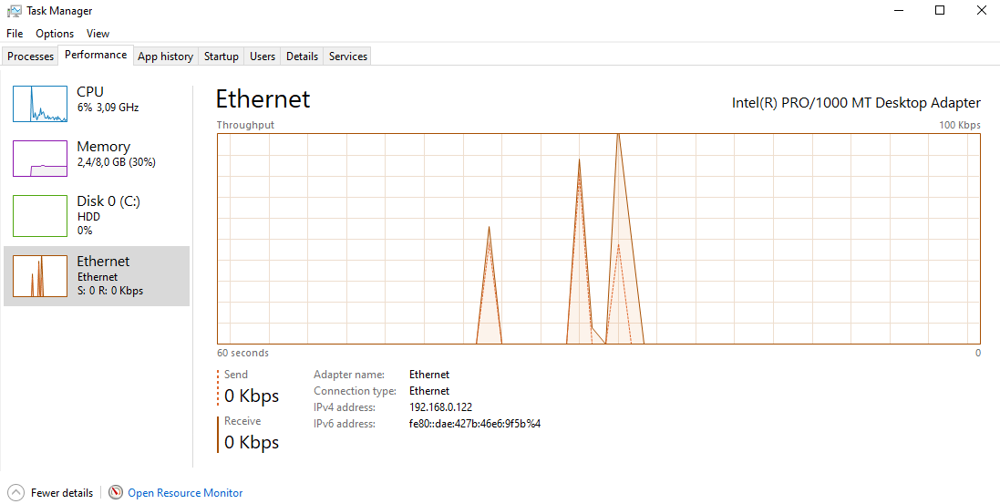
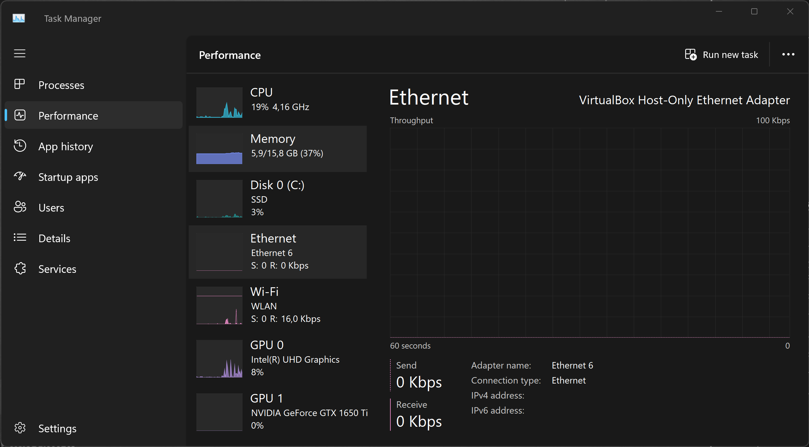
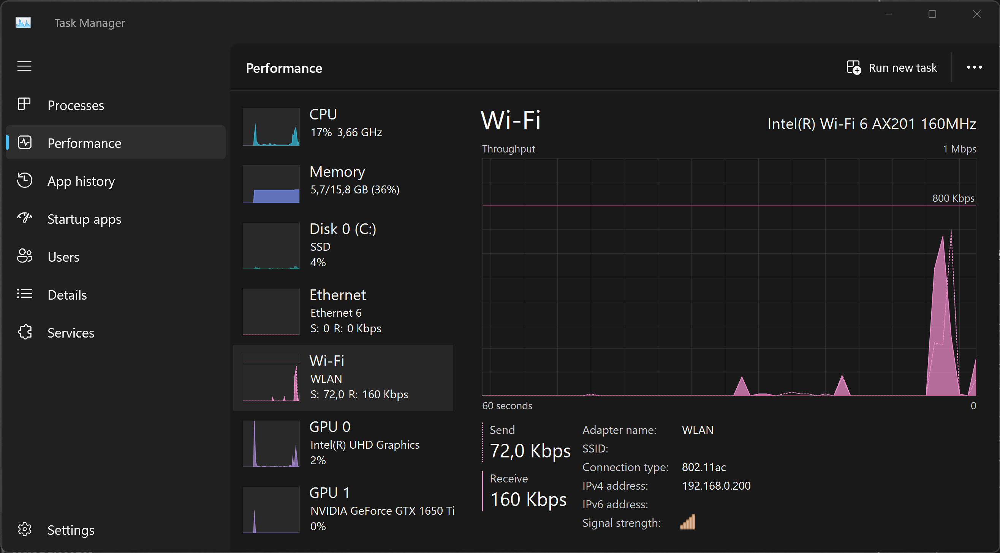
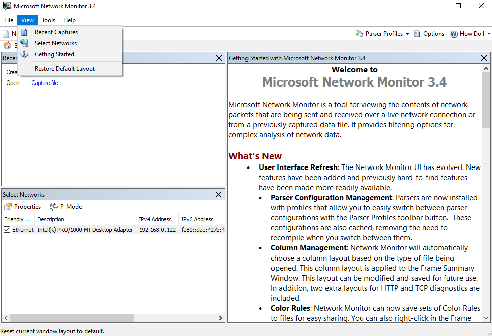
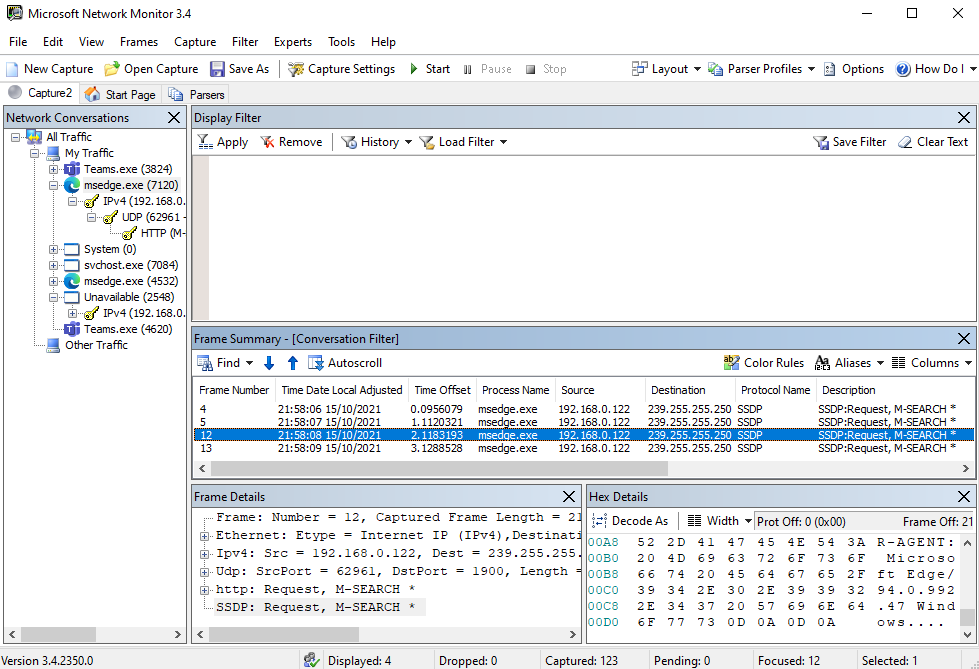
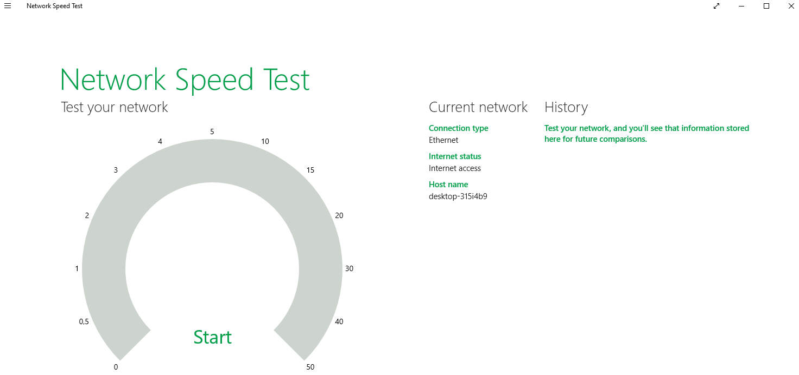
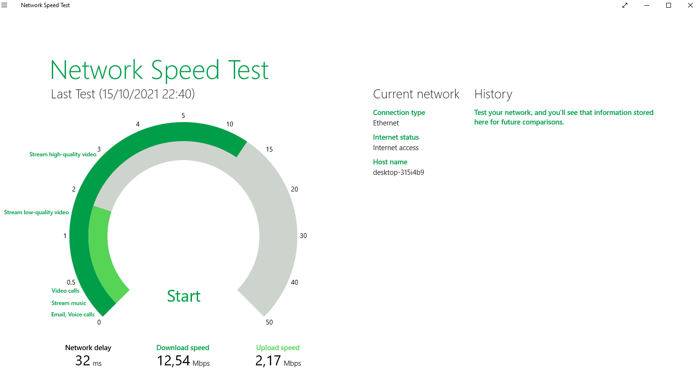

summary: BITI IPM Lab - Network
id: biti-ipm-network-windows-lab
categories: windows
tags: ipm, memory, ram, BITI, introduction
status: Published
authors: Roland Pellegrini

# BITI IPM Lab - Network
<!-- ------------------------ -->
## Before You Begin 

### What You’ll Learn
In this codelab you will learn

* how to get information about local network devices
* how to monitor networks using Windows tools
* how to check network performance

### What You'll need

#### Guest operation system (Guest OS)

This is the OS of the virtual machine. This will be Microsoft Windows.

<aside class="negative">
Important note: All codelabs for Microsoft Windows are tested on Windows 10 but should also work on Windows 11. 
</aside>

#### Administators privileges

By default, administrator privileges are required on the Host OS to install additional software. Make sure that you have the required permissions.

For the Guest OS, you will create and manage your own users. These users will therefore be different from the Host's user administration. 

<!-- ------------------------ -->

## Device Information

### What You will learn:

You can use one of the following commands to find detailed information about the physical or virtual network devices on Linux:

* Device Manager
* Windows Settings
* wmic

## Device Manager

### Description
The Device Manager (Devman) is a component of the Microsoft Windows operating system, which allows users to view and control the hardware attached to the computer. Devman is part of the Microsoft Management Console.

### Sample code

To open Devmanm, simple select `Device Manager` in the Windows Menu.

### Sample output 

To see the network adapters, simply click on the corresponding icon.


You can right-click on the Network Interface Component (NIC) to see the Adapter's properties.

<!-- ------------------------ -->

## Windows Settings

### Description
Windows Settings is a component of Microsoft Windows, which allows users adjust their user preferences, configure their operating system, and manage their connected devices.

### Sample code

To open Ethernet Properties, simple select `Settings` in the Windows Menu, then select `Network & Internet`, then the submenu `Ethernet`.

In Windows 11, do a search for `Network Connection` and confirm the result. Mark your adapter and select `Properties` from the context menu.

### Sample output 

To see the network adapters, simply click on the link `Change adapter options`.



You can right-click on the Ethernet component to see the its's properties.

<!-- ------------------------ -->

## wmic

### Description
WMI (Windows Management Instrumentation) is a programming interface that can be used to capture many aspects of Windows operating systems. This ranges from hardware, operating system settings, performance data to installed applications. WMI allows to read and write (update) values. It also allows the execution of methods and functions.

WMIC stands for WMI Command.

### Sample code

* Open a command prompt
* Type and execute the following command:

```
wmic nic get AdapterType,Name,Speed
```

### Sample output

The command provides an overview of all available adapters:

```
AdapterType     Name                                    Speed
                Microsoft Kernel Debug Network Adapter
Ethernet 802.3  Intel(R) PRO/1000 MT Desktop Adapter    1000000000
                WAN Miniport (SSTP)
                WAN Miniport (IKEv2)
                WAN Miniport (L2TP)
                WAN Miniport (PPTP)
                WAN Miniport (PPPOE)
Ethernet 802.3  WAN Miniport (IP)
Ethernet 802.3  WAN Miniport (IPv6)
Ethernet 802.3  WAN Miniport (Network Monitor)
```

## Network monitoring

### What You will learn:

You can use one of the following tools to find detailed information about the physical or virtual network devices on Microsoft Windows:

* Task Manager
* Network Monitor
* Netstat

## Task Manager

### Description

The **Windows Task Manager (Taskmon)** is a system tool found in all versions of Microsoft Windows platform's. It provides information about running applications, processes, and services, as well as computer performance, network activity, and memory information. There are two views for the Task Manager: Simplified and Advanced.

### Sample code

To use **Taskmon**, open "Start", do a search for `taskman`, and confirm the result. Or do a right-click on the Windows Taskbar and select `Task Manager` from the menu.


Microsoft improves the Task Manager between each version of Windows. Currently, Taskmon under Windows 11 has a redesigned look and some new features.


Learn more about the Task Manager from [Microsoft Learn](https://learn.microsoft.com/en-us/shows/inside/task-manager) or from [LifeWire](https://www.lifewire.com/task-manager-2626025#toc-task-manager-walkthrough).

### Sample output
To see the network activities, simply click on the tab 'Performance' and select the corresponding icon.



Under Windows 11, select either the `Ethernet` ...



... or the `Wi-Fi` icon to see some spikes up and down depending on network activities.



<aside class="positive">
We do see network activity and some spikes up and down but if we want to know the reason, we need to use another tool. We have already learned the Windows Ressource Monitor tool in BITI IPM Lab - Compute. In the next section, we will learn another tool called Network Monitor.
</aside>


## Network Monitor

### Description

**Microsoft Network Monitor** is a tool, which allows users capturing network traffic.

Microsoft Network Monitor can be downloaded [here](https://www.microsoft.com/download/details.aspx?id=4865).

<aside class="positive">
At the time of reading this, Microsoft has archived the Network Monitor.
</aside>

### Sample code

After installation, start the application and select `View -> Select Network`. If this doesn't work, then you have to log out and log in again. Make sure that your Network is selected (check again by run `View -> Select Network` again).



Next, click on `New Capture -> Start` to start network capturing. Traffic will show up in the left pane under `Network conversation`. Click on `Stop` whenever needed. Select one of the traffic conversations (here msedge.exe, the internet browser) and study the frames.



If you need the data for a longer period of time, you can save it to a file (select `File -> Save as ...`). 

## netstat

### Description

The tool **netstat** displays active TCP connections, ports on which the computer is listening, Ethernet statistics, IPv4 statistics, and much more.

<aside class="positive">
This command is available only if the Internet Protocol (TCP/IP) protocol is installed as a component of the network adapter. 
</aside>

### Sample code

To start the program, run the command with the following options:
```
netstat -an | more
```

Where,
* -a - Displays all active TCP connections and the TCP and UDP ports on which the computer is listening.
* -n - Displays active TCP connections, however, addresses and port numbers are expressed numerically and no attempt is made to determine names.

<aside class="positive">
For more information, consult the documenation or run `netstat /?`.
</aside>

### Sample output
```
Active Connections

  Proto  Local Address          Foreign Address        State
  TCP    0.0.0.0:135            0.0.0.0:0              LISTENING
  TCP    0.0.0.0:445            0.0.0.0:0              LISTENING
  TCP    192.168.0.122:139      0.0.0.0:0              LISTENING
  TCP    192.168.0.122:52193    52.133.149.12:443      ESTABLISHED
  TCP    192.168.0.122:52202    52.134.91.30:443       ESTABLISHED
  TCP    192.168.0.122:52777    52.134.91.160:443      ESTABLISHED
  TCP    192.168.0.122:52778    51.134.13.153:443      CLOSE_WAIT
  --More--
```
Where,
* The first column (proto stands for protocol) lists all TCP and UDP connections on the machine. 
* The second column provides the local IP address and port number.
* The third column provides the remote IP address and port number.
* The final column provides the state of the connection.

Furthermore,
* `LISTENING` - Listening for inbound connections. 
* `ESTABLISHED` - Connection has been established. 
* `CLOSE_WAIT` - Remote shutdown. Local is waiting for the socket to close.


## Network Performance

### What You will learn:

You can use the following application for Windows to check the network performance.

* Network Speed Test

<aside class="positive">
This is a lab, not a hands-on exercise.
</aside>


## Network Speed Test

### Description

The Microsoft tool **Network Speed Test** measures the network delay, download speed and upload speed by using servers around the world. Based on the connection’s speed, Network Speed Test will tell you what activities you might be able to do, such as stream music or video calls.

<aside class="positive">
WARNING:

When you test your network using the Network Speed Test, certain characteristics of your device and the network connection will be sent to Microsoft. Do not use this program if you do not agree with this policy.
</aside>

You can download **Network Speed Test** from the Microsoft Store.


### Sample code

After launching it, Network Speedtest is ready to go. Simply click on `Start`.


### Sample output

After the Speedtest run, the tool shows you a summary of details including network delay, the download and upload speed. The gauge chart also shows you recommendations on what you can do with this network throughput.



### Clean Up

You can exit the program and un-install it if desired.

This is the end of the lab.