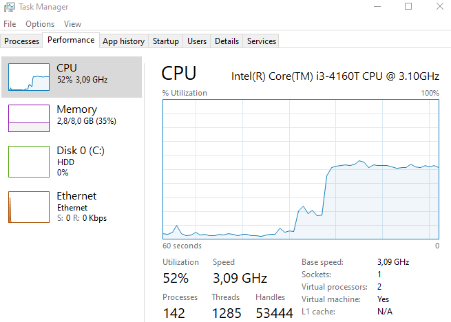
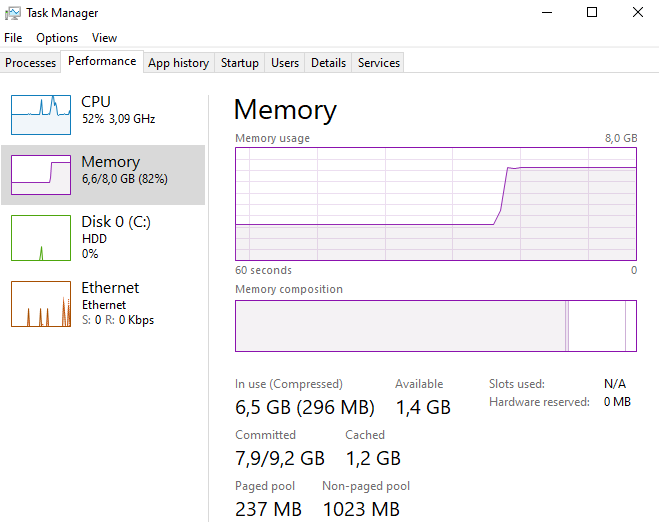

summary: BITI IPM Lab - Stress
id: biti-ipm-stress-lab
categories: linux
tags: ipm, compute, cpu, BITI, introduction
status: Published
authors: Roland Pellegrini

# BITI IPM Lab - Stress
<!-- ------------------------ -->
## Before You Begin 

There are many reasons why you might want to stress test your Linux system. System administrators may want to see how their operating system and hardware perform under full load to detect software bugs or hardware failures.

### What You’ll Learn

There are plenty of tools and utilities created for this purpose. This codelab will introduce you to some of the most helpful applications.

* How to perform stress the CPU with an one-liner (Linux)
* How to perform stress the CPU using the stress application (Linx)
* How to perform stress the CPU using the CPU Stress application (Windows)

<aside class="positive">
Warning: Running the following tools with root privileges stress your system, so use them judiciously.
</aside>

### What You'll need

#### Guest operation system (Guest OS)

This is the OS of the virtual machine.

#### Administators privileges

Administrator privileges are required on the GuestOS to install and run additional software. Make sure that you have the required permissions.


## Stress with Yes (Linux)

This one-liner creates a `yes` process that runs on each processor core of the machine. The `yes` command repeatedly prints the letter `y` until it terminates. It uses 100% of a CPU core. If Hyper-Threading is enabled, twice as many yes processes will be created.

Open a shell and run the following one-liner:

```
for i in $(seq $(getconf _NPROCESSORS_ONLN)); do yes > /dev/null & done
```

The output of this one-line will look something like this:


The command `getconf _NPROCESSORS_ONLN` returns the number for CPU cores. The command `seq` prints a sequence of numbers from 1 up to the amount of CPU Cores. FInally, the look `for i in .... done` takes the sequence and starts a yes process for each of them, redirecting the output to dev/null.

As a result, the command `htop` shows the CPU utilization:


To kill all yes processes, run the following one-liner:

```
killall yes
```

## Stress with Stress (Linux)

The `stress` program is a simple workload generator for POSIX systems. It allows system administrator to run a configurable amount of CPU, memory, disk and I/O stress on the target system.

### Install Stress

Open a shell and run the following command with root privileges:

```
apt update
apt install stress
```

### Run CPU Stress

Open a shell and run the following command with root privileges:

```
stress -c 1 -t 60s -v
```

Where,
* `-c 1`   : Run one (1) worker spinning on sqrt()
* `-t 60s` : Timeout after 60 seconds
* `-v`     : Be verbose

The output will look something like this:


### Watch the results

To see how the stress commmand utilize the CPU, open a shell and start the `htop` application:
```
htop
```

The output will look something like this:


### Run Memory Stress

Open a shell and run the following command with root privileges:

```
stress -m 2 --vm-bytes 1024M  -t 20s -v
```

Where,
* `-m 2`   : Run two (2) workers spinning on sync()
* `--vm-bytes 1024M` : malloc 1024MB per vm worker
* `-t 20s` : Timeout after 20 seconds


### Watch the results

To see how the stress commmand utilize Memory, open a shell and start the `htop` application:
```
htop
```

The output will look something like this:


## Stress CPU with CPUStres (Windows)

Microsoft offers a set of tools under the name of **Sysinternals Suite** which a useful for IT-Administrators. One of those tools is called "CPU Stress". It is a portable application and it can be used to simulate high CPU usage by running up to 64 threads (!).

You can download CPU Stress from [here](https://docs.microsoft.com/en-us/sysinternals/downloads/cpustres). After downloading, unzip the package and launch the 64-bit version of CPU Stress.


After lauch, the application sets a separate thread for each of the available CPU cores (here 4). You can activate threads with a right-click.


You can change the thread priority between idle and time critical. Other possible values are low, below normal, normal, above normal, and highest. Additionally, you can change the activity level and set it to low, medium, busy, or maximum. 


### Watch the results

A higher activity level will load the CPU core with constantly running threads as shown in the Task Manager. Open TaskMon and see the result:




## Stress RAM with Testlimit (Windows)

Testlimit is another tool from the **Sysinternals Suite**. TestLimit can soak up varying amounts of RAM.

You can download Testlimit from [here](https://docs.microsoft.com/en-us/sysinternals/downloads/testlimit). Check out the parameters which are listed on the website. After downloading, unzip the package. You need powershell to run the 64-bit version of Testlimit.

### Test the limit

Open the Windows Powershell, change to the Testlimit directory and run the following command:

```
testlimit -d 1024 -c 4
```

Where,
* `-d 1024` : Leak and touch private memory of 1024 BM
* `-c 4`     : create four (4) objects (= 4096 MB total) 

Sample output:
```
Testlimit v5.24 - test Windows limits
Copyright (C) 2012-2015 Mark Russinovich
Sysinternals - www.sysinternals.com

Process ID: 7832

Leaking private bytes with touch 1024 MB at a time...
Leaked 4096 MB of private memory (4096 MB total leaked). Lasterror: 0
The operation completed successfully.
```

### Watch the results

Testlimit creates a process with ID 7832 with a virtual memory size of 4096 MB. Open TaskMon and see the result:

* Increase of memory usage in Task Manager


* Details of the reserved process memory

