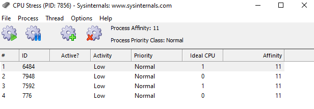
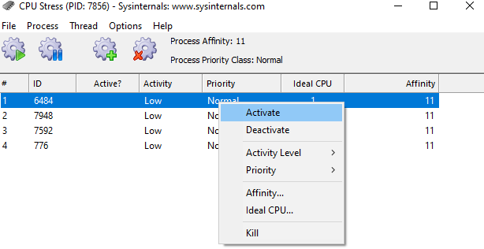
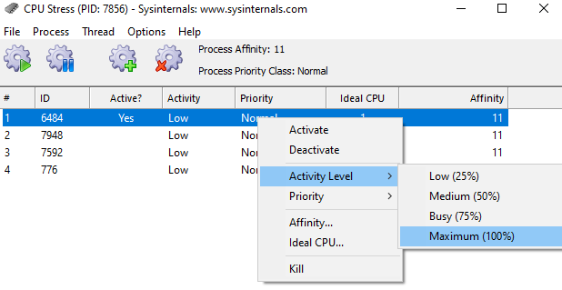

summary: BITI IPM Lab - Stress
id: biti-ipm-stress-windows-lab
categories: windows
tags: ipm, compute, cpu, BITI, introduction
status: Published
authors: Roland Pellegrini

# BITI IPM Lab - Stress
<!-- ------------------------ -->
## Before You Begin 

### What You’ll Learn

In this codelab you will learn

* how to perform stress the CPU using the CPU Stress application
* how to perform stress the RAM using the Testlimit application

<aside class="negative">
Warning: Running the tools with Administrator privileges stress your system, so use them judiciously.
</aside>

### What You'll need

#### Guest operation system (Guest OS)

This is the OS of the virtual machine. This will be Microsoft Windows.

#### Administators privileges

By default, administrator privileges are required on the Host OS to install additional software. Make sure that you have the required permissions.

For the Guest OS, you will create and manage your own users. These users will therefore be different from the Host's user administration. 

## CPUStres

### Description

Microsoft offers a set of tools under the name of **Sysinternals Suite** which a useful for IT-Administrators. One of those tools is called "CPU Stress". It is a portable application and it can be used to simulate high CPU usage by running up to 64 threads (!).

You can download CPU Stress from [here](https://docs.microsoft.com/en-us/sysinternals/downloads/cpustres). After downloading, unzip the package and launch the 64-bit version of CPU Stress.



After lauch, the application sets a separate thread for each of the available CPU cores (here 4). You can activate threads with a right-click.



You can change the thread priority between idle and time critical. Other possible values are low, below normal, normal, above normal, and highest. Additionally, you can change the activity level and set it to low, medium, busy, or maximum. 



### Watch the results

A higher activity level will load the CPU core with constantly running threads as shown in the Task Manager. Open TaskMon and see the result:


## Testlimit

### Description

Testlimit is another tool from the **Sysinternals Suite**. TestLimit can soak up varying amounts of RAM.

You can download Testlimit from [here](https://docs.microsoft.com/en-us/sysinternals/downloads/testlimit). Check out the parameters which are listed on the website. After downloading, unzip the package. You need powershell to run the 64-bit version of Testlimit.

### Sample code

Open the Windows Powershell, change to the Testlimit directory and run the following command:

```
testlimit -d 1024 -c 4
```

Where,
* `-d 1024` : Leak and touch private memory of 1024 BM
* `-c 4`     : create four (4) objects (= 4096 MB total) 

### Sample output:

```
Testlimit v5.24 - test Windows limits
Copyright (C) 2012-2015 Mark Russinovich
Sysinternals - www.sysinternals.com

Process ID: 7832

Leaking private bytes with touch 1024 MB at a time...
Leaked 4096 MB of private memory (4096 MB total leaked). Lasterror: 0
The operation completed successfully.
```

### Watch the results

Testlimit creates a process with ID 7832 with a virtual memory size of 4096 MB. Open TaskMon and see the result:

* Increase of memory usage in Task Manager


* Details of the reserved process memory in the tab Processes of the Task Manager.

