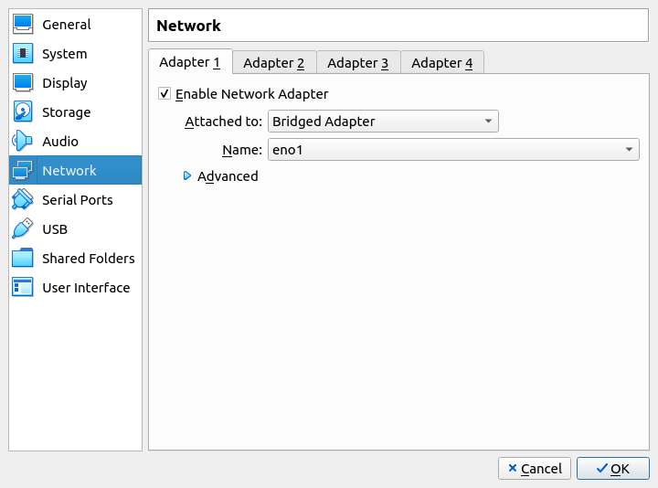

summary: BITI IPM Lab - Prepare VirtualBox
id: biti-ipm-vbox-lab
categories: codelab
tags: BITI, ipm, introduction
status: Published
authors: Roland Pellegrini

# BITI IPM Lab - Prepare VirtualBox
<!-- ------------------------ -->
## Before You Begin 

### What You’ll Learn
Oracle VM VirtualBox is a free and open-source hosted hypervisor for x86 hardware, which allows the user to install additional operating systems (guests) under a running system (host).

This codelab shows you 
* how to install VirtualBox on your HostOS
* how to install a GuestOS based on Debian 11
* how to install software required for the lectures.

## What You'll need

### Host operating system (Host OS)

This is the OS of the physical computer on which Oracle VM VirtualBox is installed.

This can be Microsoft Windows, Linux, or Mac OS host. Check the Documentation on the [official web site](https://www.virtualbox.org/) for more details.

### Administators privileges

By default, administrator privileges are required on the Host OS to install additional software. Make sure that you have the required permissions.

For the Guest OS, you will create and manage your own users. These users will therefore be different from the Host's user administration. 

Typically, the GuestOS user for all codelabs is called `icinga`. 

## Get set up Virtual Box

### VirtualBox.org

- Download VirtalBox (packaged for your Host-OS) from the [official web site](https://www.virtualbox.org/).
- Install it on your host. For Windows: make sure to disable all Hyper-V features first.
- Download the VirtualBox Extension Pack from the [official web site](https://www.virtualbox.org/).
- Install the VirtualBox Extension Pack via File --> Preferences --> Extensions.
.
- Setup a virtual machine for Debian installation.
- Set the virtual machine memory size to 4 GB for smooth operation. If your HostOS has less memory, reduce the memory size accordingly for the virtual machine.
- Ensure that the virtual network is attached to a Bridge Adapter (Open Settings -> Network -> Adapter 1 -> Attached to Bridge Adapter).


<aside class="negative">
If UEFI is enabled on your Host, compilation of VirtualBox kernel modules will fail due to security reason. In this case, all VirtualBox kernel modules must be signed manually. Contact your instructor for more details.
</aside>

## Get set up Debian

### Debian 11 Bullseye
- Download Debian 11 Bullseye from from the [official web site](https://www.debian.org/).
- Ask your instructur for details about root and non-privileged user and password to ensure smooth administration.
- Start the virtual Machine and install Debian.
- Keep the installation simple. 
- Use default settings. No need to encrypt your disks.
- Set up the given user and password. Ask your instructor for more details.
- After installation has finished, reboot the VM, log in with user and password, open a shell and fire a ping to a server of your choice. If you get a response, then you have done a good job. Congratulations! 

### Administrative Tasks

First, add the user icinga to the sudoers. Open a terminal as icinga user and run the following commands: 

```
su - 
adduser icinga sudo
```

Where,
- su - : switch to root user
- adduser : add icinga user to the /etc/sudoers file

Now logoff from Gnome and and login again to activate `sudo` for icinga user.

Second, from time to time, your debian installation requires an update and an upgrade due to security issues. To keep your installation up-to-date, run the following commands with root privileges:

```
sudo apt update
sudo apt upgrade
```

##  Required Software 

###  From Debian repository

The following software packages are part of the **official** Debian Repository and can be installed with the following command: 

```
sudo apt install mc htop cpulimit stress stress-ng stressant hdparm smartmontools inxi iotop dstat speedtest-cli iftop etherape monitorix cockpit bonnie++ fio gdu
```


###  From an external repository
The Phoronix Test Suite is a comprehensive testing and benchmarking platform available for the Linux operating system. The software is not part of the Debian Repository but can be installed easily.

The installation is documented in the codelab `BITI IPM - Benchmark`.