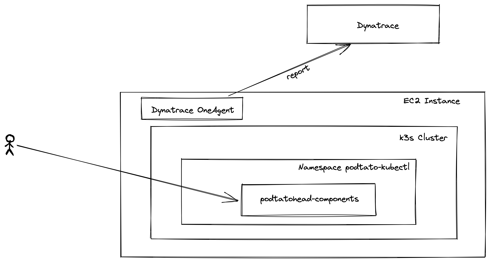

summary: Lab 1 - Monitor a Microservice Application using Dynatrace
id: tmac-pt-dynatrace-lab
categories: aws, dynatrace
tags: dynatrace, aws, MCCE, tmac-pt, intermediate
status: Published 
authors: Thomas Schuetz

# TMAC Lab 1 - Monitor a Microservice Application using Dynatrace
<!-- ------------------------ -->


## Overview

### What You’ll Learn 

 

- Set Up an AWS Instance
- Install K3s
- Install Dynatrace Agent
- Install a Microservice Application on K3s
- Inspect Monitoring of the Application

## Set up an AWS Instance
Duration: 5

- Open the AWS Console
- Search for EC2
- Click on Launch Instances
  * Step 1: Choose an Amazon Machine Image (AMI)
    * Amazon Linux 2 AMI (HVM), SSD Volume Type (x86)
  * Step 2: Choose an Instance Type
    * t3.medium
  * Step 3: Configure Instance Details
    * Keep Default
  * Step 4: Add Storage
    * Keep Default
  * Step 5: Add Tags
    * Name: podtatohead-k3s
  * Step 6: Configure Security Group
    * Create New Security Group
      * Security Group Name: podtatohead-http-in
      * Add Rules
        * Type: HTTP
        * Type: HTTPS
        * Rest Default
    * Review and Launch
  * Launch
  * Select an existing key-pair or create one
  * Launch instance

## Getting your Instance Name on the AWS CLI
- Prerequisites:
  * Installed awscli

- Open a Shell

- Ensure that aws-cli is configured
```
cat ~/.aws/credentials
```

- Describe all Instances
```
aws ec2 describe-instances 
```

- You should see all EC2 Instances (in our case one)

- Query the Instance Name
```
aws ec2 describe-instances --filters "Name=tag:Name,Values=podtatohead-oauth" --query "Reservations[].Instances[].PublicDnsName" --out text | xargs
[
    "<instance-name>.compute-1.amazonaws.com"
]
```

- Put the Instance Name in a Variable
```
  INSTANCE_HOSTNAME=$(aws ec2 describe-instances --filters "Name=tag:Name,Values=podtatohead-oauth" --query "Reservations[].Instances[].PublicDnsName" --out text | xargs)
```
## Open a shell to your ec2-instance
Duration: 1 

- Get the instance hostname from the AWS console (Public IPv4 DNS or Public IPv4 Address)
- Open a shell
 ```
  ssh -i ~/.ssh/labsuser.pem ec2-user@${INSTANCE_HOSTNAME}

       __|  __|_  )
       _|  (     /   Amazon Linux 2 AMI
      ___|\___|___|

  https://aws.amazon.com/amazon-linux-2/ 
```

<aside class="positive">
:Now you're connected to your AWS Instance  
</aside>

## Install Dynatrace OneAgent
- Open Dynatrace
- Click on "Manage -> Deploy Dynatrace"
  - Start Installation
  - Select "Linux"
  - "Create PaaS Token"
  - Copy the Download Link, paste it to the shell of your VM and execute it
  - Set "Custom Host Name" to your Student ID
  - Copy the installer execution command and run it on your vm as root (`sudo`)
- Wait until you see your host in Dynatrace ("Infrastructure -> Hosts")
<aside class="positive">
Your Host is monitored now and known technologies will be auto-instrumented
</aside>

## Install K3s
- Open a shell to your host
- Install K3s
```
sudo -i
curl -sfL https://get.k3s.io | INSTALL_K3S_EXEC="server --no-deploy=traefik" sh -s -
export PATH=$PATH:/usr/local/bin
```
- Check if everything your k3s node is up
```
kubectl get nodes

NAME                            STATUS   ROLES                  AGE   VERSION
ip-172-31-12-239.ec2.internal   Ready    control-plane,master   18s   v1.22.7+k3s1
```
<aside class="positive">
If your node is ready, your k3s node is operational
</aside>

## Install your application (podtatohead)
- Open a shell to your host
- Install the Manifest
```
kubectl apply -f https://raw.githubusercontent.com/fhb-codelabs/sample-code-repo/master/manifests/podtato-kubectl.yaml
```
- Wait until all pods are ready (`kubectl get pods -n podtato-kubectl`)
- Open PodTatoHead (http://your-ip-address)
<aside class="positive">
You should see the podtatohead now
</aside>

## Inspect your application in Dynatrace
- Open Dynatrace
- Inspect:
  - Infrastructure -> Hosts
  - Applications and Microservices -> Service -> entry
    - Service Flow
    - Distributed Traces
  - Observe and explore
    - SmartScape Topology
  - Whatever you like

<aside class="positive">
You installed a k3s environment, added the Dynatrace OneAgent and installed an application and it's basically monitored now
</aside>

